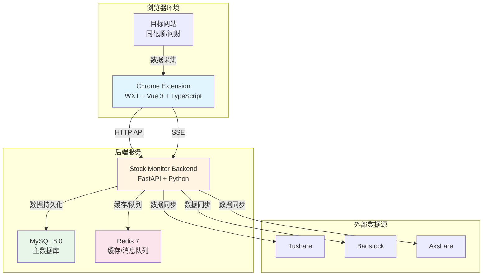
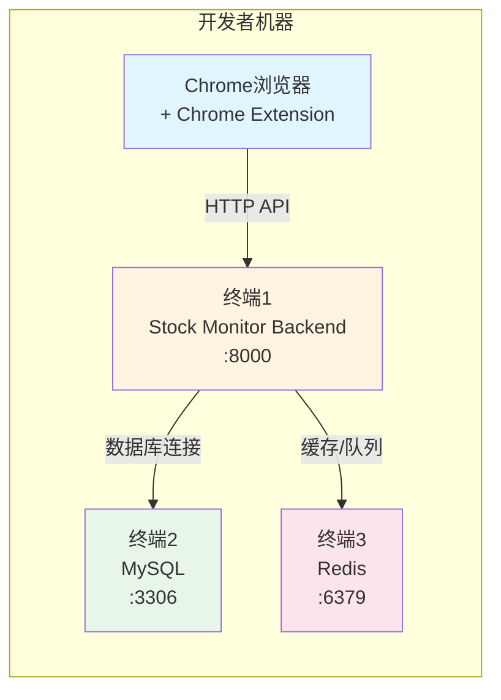
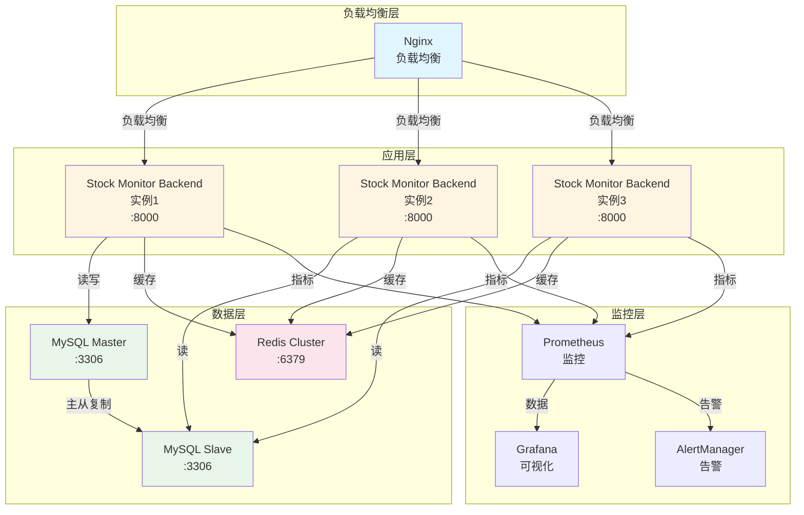

# Event-Crawler 系统架构总览

## 1. 概述

Event-Crawler 是一个基于浏览器扩展和后端API的股票数据采集与监控系统，实现了从浏览器环境到后端服务的完整数据流闭环。系统支持股票实时监控、形态分析、自动化爬虫等功能。

**项目位置**: `/Users/mac/StudioProjects/open-citycloud/projects/event-crawler`

**文档版本**: V1.0  
**最后更新**: 2026-01-08

---

## 2. 系统整体架构

### 2.1 架构图



### 2.2 核心模块

#### 2.2.1 Chrome Extension（浏览器扩展）

**路径**: `/Users/mac/StudioProjects/open-citycloud/projects/event-crawler/apps/chrome-extension`

**核心职责**:
- 浏览器环境内的数据采集（网络请求、DOM元素）
- 用户界面展示（侧边栏、弹窗、通知）
- 本地数据处理（去重、语义分析、缓存）
- HTTP API通信（与后端服务交互）

**技术栈**:
- **框架**: WXT 0.20.0 + Vue 3.5.13
- **语言**: TypeScript 5.9.3
- **AI/ML**: 
  - `@xenova/transformers`: 本地NLP模型
  - `hnswlib-wasm-static`: 向量检索
- **数据可视化**: Recharts 3.2.1
- **状态管理**: Vue 3 Composition API

**关键模块**:
- `entrypoints/background/`: 后台脚本，处理API通信
- `entrypoints/popup/`: 弹窗界面
- `entrypoints/sidepanel/`: 侧边栏界面
- `entrypoints/content/`: 内容脚本，注入到目标页面
- `utils/`: 工具类（数据提取、去重、语义分析等）

#### 2.2.2 Stock Monitor Backend（股票监控后端）

**路径**: `/Users/mac/StudioProjects/open-citycloud/projects/event-crawler/apps/stock-monitor-backend`

**核心职责**:
- 数据存储与管理（MySQL + Redis）
- 业务逻辑处理（形态分析、评分计算、监控管理）
- RESTful API服务（21个控制器）
- 定时任务调度（数据同步、评分计算）
- 实时推送（SSE事件流）

**技术栈**:
- **框架**: FastAPI 0.104.1
- **语言**: Python 3.9+
- **数据库**: 
  - MySQL 8.0.35（主数据库）
  - Redis 7-alpine（缓存和消息队列）
  - SQLAlchemy 2.0.23（ORM）
- **异步**: asyncio + aiomysql
- **任务调度**: APScheduler 3.10.0+
- **日志**: Loguru 0.7.2
- **数据源**:
  - Tushare 1.2.0+（官方数据）
  - Baostock（免费数据）
  - Akshare（开源数据）
  - TDX（通达信）

**架构分层**:
```
Controller Layer (21 Controllers)
    ↓
Service Layer (28 Services)
    ↓
Repository Layer (DAO)
    ↓
Database Layer (MySQL + Redis)
```

**关键模块**:
- `api/`: 21个控制器，涵盖股票、监控、分析等所有业务
- `services/`: 28个服务类，实现核心业务逻辑
- `models/`: SQLAlchemy数据模型定义
- `repositories/`: 数据访问层封装
- `config/`: 配置管理（数据库、日志、环境变量）

---

## 3. 技术栈选型说明

### 3.1 前端技术栈

| 技术 | 版本 | 用途 | 选型理由 |
|------|------|------|----------|
| **WXT** | 0.20.0 | Chrome扩展框架 | 现代化、类型安全、支持Vue/React |
| **Vue 3** | 3.5.13 | UI框架 | 响应式、组合式API、生态成熟 |
| **TypeScript** | 5.9.3 | 类型系统 | 静态类型检查、IDE支持、代码质量 |
| **@xenova/transformers** | 2.17.2 | 本地NLP模型 | 浏览器端运行、无需API调用 |
| **hnswlib-wasm-static** | 0.8.5 | 向量检索 | 高性能近似最近邻搜索 |
| **Recharts** | 3.2.1 | 数据可视化 | React生态、声明式API |

### 3.2 后端技术栈

| 技术 | 版本 | 用途 | 选型理由 |
|------|------|------|----------|
| **FastAPI** | 0.104.1 | Web框架 | 现代、高性能、自动API文档 |
| **Uvicorn** | 0.24.0 | ASGI服务器 | 高性能异步服务器 |
| **SQLAlchemy** | 2.0.23 | ORM | 功能强大、异步支持 |
| **aiomysql** | 0.2.0 | MySQL异步驱动 | 高性能异步数据库操作 |
| **Pydantic** | 2.5.0 | 数据验证 | 类型安全、自动文档 |
| **APScheduler** | 3.10.0+ | 定时任务 | 灵活的任务调度 |
| **Loguru** | 0.7.2 | 日志 | 简洁、高性能、结构化 |
| **Tushare** | 1.2.0+ | 数据源 | 官方数据、质量高 |
| **Baostock** | - | 数据源 | 免费数据、覆盖广 |
| **Akshare** | - | 数据源 | 开源、数据丰富 |

### 3.3 数据库技术栈

| 技术 | 版本 | 用途 | 选型理由 |
|------|------|------|----------|
| **MySQL** | 8.0.35 | 主数据库 | 成熟稳定、事务支持、JSON列 |
| **Redis** | 7-alpine | 缓存/队列 | 高性能、数据结构丰富 |
| **Docker** | - | 容器化部署 | 环境一致性、易于部署 |

---

## 4. 模块划分和职责边界

### 4.1 Chrome Extension 职责边界

**负责**:
- ✅ 浏览器环境内的数据采集（网络请求、DOM元素）
- ✅ 用户界面展示（侧边栏、弹窗、通知）
- ✅ 本地数据处理（去重、语义分析、缓存）
- ✅ HTTP API通信（与后端服务交互）

**不负责**:
- ❌ 数据持久化（不直接操作数据库）
- ❌ 复杂业务逻辑（形态分析、评分计算）
- ❌ 系统级操作（文件读写、进程管理）

**接口定义**:
- **HTTP API**:
  - `POST /api/v1/stocks/data`: 提交股票数据
  - `POST /api/v1/stocks/data/batch`: 批量提交数据
  - `GET /api/v1/crawler/events`: SSE实时更新端点
  - `POST /api/v1/crawler/parse_html`: 解析HTML并检查登录状态

### 4.2 Stock Monitor Backend 职责边界

**负责**:
- ✅ 数据持久化（MySQL + Redis）
- ✅ 业务逻辑处理（形态分析、评分计算、监控管理）
- ✅ 定时任务调度（数据同步、评分计算）
- ✅ RESTful API服务（21个控制器）
- ✅ 实时推送（SSE事件流）

**不负责**:
- ❌ 浏览器环境操作（不直接操作DOM）
- ❌ 用户界面渲染（纯后端服务）

**接口定义**:
- **健康检查**:
  - `GET /api/v1/health`: 基础健康检查
  - `GET /api/v1/health/detailed`: 详细健康检查
  - `GET /api/v1/health/database`: 数据库连接检查
- **股票数据**:
  - `GET /api/v1/stocks/info`: 获取股票列表
  - `POST /api/v1/stocks/info`: 创建股票信息
  - `POST /api/v1/stocks/data`: 提交股票数据
  - `POST /api/v1/stocks/data/batch`: 批量提交数据
- **监控管理**:
  - `GET /api/v1/monitors`: 获取监控列表
  - `POST /api/v1/monitors`: 添加监控
  - `DELETE /api/v1/monitors/{code}`: 删除监控
- **网络数据**:
  - `POST /api/v1/network/data`: 接收网络数据
  - `GET /api/v1/network/data`: 查询网络数据
- **问财数据**:
  - `POST /api/v1/wencai/parse`: 解析问财HTML
  - `GET /api/v1/wencai/concepts`: 获取概念云图
- **定时任务**:
  - `GET /api/v1/timed-task/ws`: WebSocket连接
  - `POST /api/v1/timed-task/executor/start`: 启动执行器
  - `POST /api/v1/timed-task/batch-create`: 批量创建任务

---

## 5. 部署架构

### 5.1 开发环境部署

**架构图**:


**启动顺序**:
1. **启动数据库服务**:
   ```bash
   cd /Users/mac/StudioProjects/open-citycloud/projects/event-crawler/apps/stock-monitor-backend
   docker-compose up -d mysql redis
   ```

2. **启动Stock Monitor Backend**:
   ```bash
   cd /Users/mac/StudioProjects/open-citycloud/projects/event-crawler/apps/stock-monitor-backend
   python run.py --mode dev
   ```

3. **启动Chrome Extension**:
   ```bash
   cd /Users/mac/StudioProjects/open-citycloud/projects/event-crawler/apps/chrome-extension
   npm run dev
   ```

**服务端口**:
- Stock Monitor Backend: 8000
- MySQL: 3306
- Redis: 6379

### 5.2 生产环境部署

**架构图**:


**Docker Compose配置**:
```yaml
version: '3.8'
services:
  app:
    build: .
    ports:
      - "8000:8000"
    depends_on:
      - db
      - redis
    environment:
      - DATABASE_URL=mysql+aiomysql://stock_user:password@db:3306/stock_monitor
      - REDIS_URL=redis://redis:6379/0
    restart: always

  db:
    image: mysql:8.0.35
    environment:
      MYSQL_DATABASE: stock_monitor
      MYSQL_USER: stock_user
      MYSQL_PASSWORD: stock123456
      MYSQL_ROOT_PASSWORD: root123456
    ports:
      - "3306:3306"
    volumes:
      - mysql_data:/var/lib/mysql
    restart: always

  redis:
    image: redis:7-alpine
    ports:
      - "6379:6379"
    volumes:
      - redis_data:/data
    restart: always

  phpmyadmin:
    image: phpmyadmin/phpmyadmin:latest
    ports:
      - "8080:80"
    environment:
      PMA_HOST: db
      PMA_PORT: 3306
    depends_on:
      - db
    restart: always

volumes:
  mysql_data:
  redis_data:
```

**服务端口**:
- Stock Monitor Backend: 8000
- MySQL: 3306
- Redis: 6379
- phpMyAdmin: 8080

---

## 6. 性能指标要求

### 6.1 API性能指标

| 指标 | 目标值 | 说明 |
|------|--------|------|
| **响应时间** | < 200ms | P95响应时间 |
| **吞吐量** | > 1000 QPS | 每秒请求数 |
| **并发数** | > 500 | 并发连接数 |
| **可用性** | > 99.9% | 服务可用性 |

### 6.2 数据库性能指标

| 指标 | 目标值 | 说明 |
|------|--------|------|
| **查询响应时间** | < 50ms | 普通查询 |
| **复杂查询时间** | < 200ms | 包含JOIN的查询 |
| **连接池大小** | 10-50 | 根据负载调整 |
| **缓存命中率** | > 80% | Redis缓存命中率 |

### 6.3 浏览器扩展性能指标

| 指标 | 目标值 | 说明 |
|------|--------|------|
| **内存占用** | < 100MB | 扩展内存使用 |
| **CPU占用** | < 5% | 扩展CPU使用 |
| **数据采集延迟** | < 100ms | 从采集到提交 |

### 6.4 数据处理性能指标

| 指标 | 目标值 | 说明 |
|------|--------|------|
| **数据去重** | < 10ms | 单条数据处理 |
| **语义分析** | < 500ms | 单条文本分析 |
| **批量处理** | > 1000条/秒 | 批量数据处理 |

---

## 7. 安全要求

### 7.1 数据安全

- **敏感数据加密**: Cookies、Token等敏感信息必须加密存储
- **HTTPS通信**: 生产环境必须使用HTTPS
- **数据脱敏**: 日志中不得记录敏感信息

### 7.2 访问控制

- **API认证**: 实现API Key或JWT认证
- **权限控制**: 基于角色的访问控制（RBAC）
- **请求限流**: 防止DDoS攻击

### 7.3 代码安全

- **依赖安全**: 定期更新依赖，修复安全漏洞
- **输入验证**: 所有用户输入必须验证
- **SQL注入防护**: 使用参数化查询

---

## 8. 可扩展性

### 8.1 水平扩展

- **应用层**: 支持多实例部署，通过负载均衡分发请求
- **数据库层**: 支持主从复制、读写分离
- **缓存层**: 支持Redis集群

### 8.2 功能扩展

- **插件化架构**: 支持动态加载数据源插件
- **规则引擎**: 支持自定义监控规则
- **API扩展**: 支持第三方API集成

---

## 9. 监控和日志

### 9.1 监控指标

- **应用监控**: 响应时间、吞吐量、错误率
- **系统监控**: CPU、内存、磁盘、网络
- **业务监控**: 股票数据采集量、监控数量、告警数量

### 9.2 日志规范

- **日志级别**: DEBUG、INFO、WARNING、ERROR、CRITICAL
- **日志格式**: JSON格式，包含时间戳、级别、消息、上下文
- **日志存储**: 集中式日志存储（ELK或Loki）

---

## 10. 总结

Event-Crawler项目采用前后端分离架构，Chrome Extension负责浏览器环境内的数据采集和用户交互，Stock Monitor Backend负责数据持久化和业务逻辑处理。系统通过HTTP API和SSE实现数据通信，支持实时数据推送和批量数据处理。

**架构优势**:
1. **模块化设计**: 各模块职责清晰，边界明确
2. **技术选型合理**: 使用现代化、高性能的技术栈
3. **可扩展性强**: 支持水平扩展和功能扩展
4. **文档完善**: 丰富的技术文档和API文档

**未来优化方向**:
1. **性能优化**: 引入Redis缓存层，优化数据库查询
2. **监控告警**: 集成Prometheus + Grafana
3. **安全加固**: 实现API认证和授权
4. **测试覆盖**: 增加端到端测试和性能测试

---

**文档维护**: 本文档应随着项目架构的演进而持续更新，确保与实际架构保持一致。
