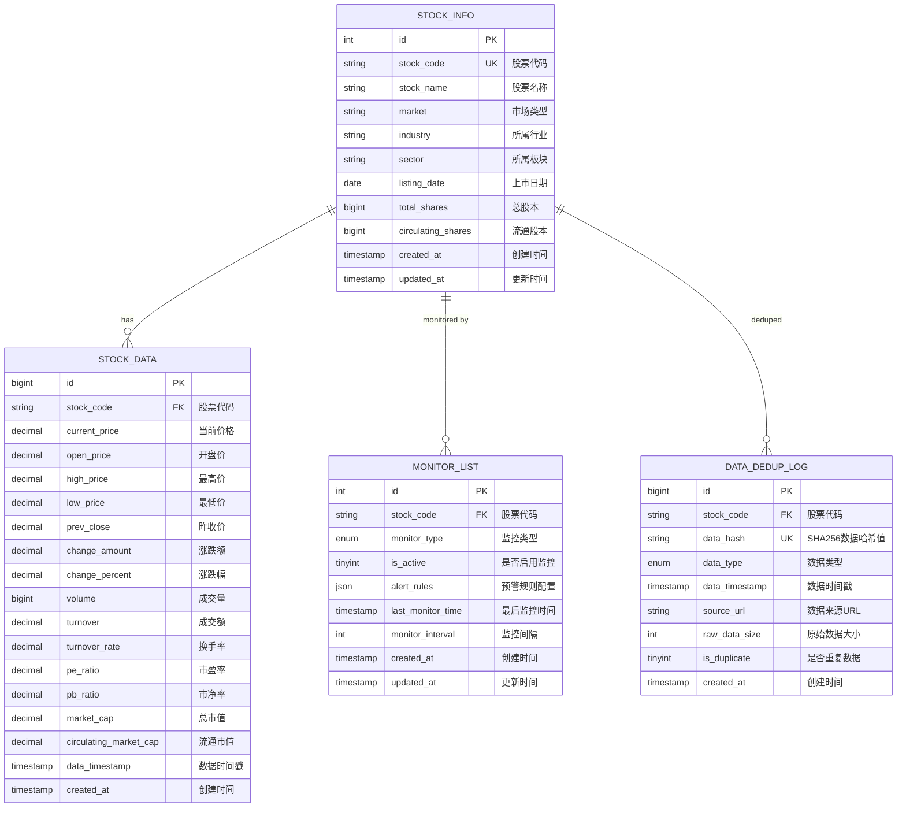
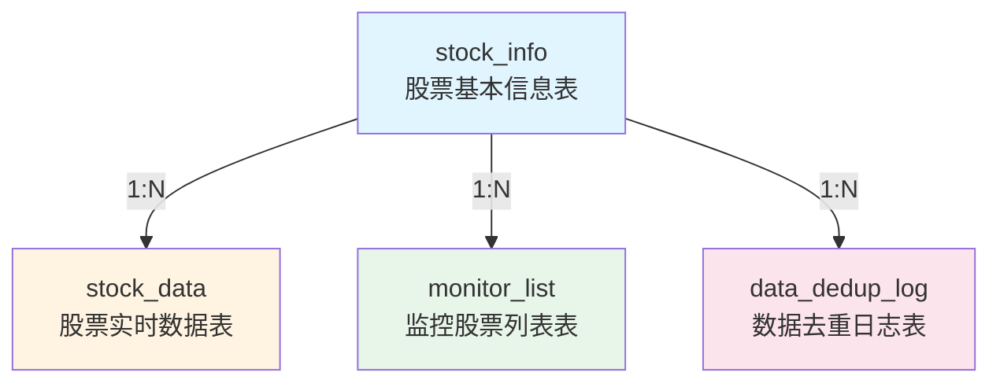

# Event-Crawler 数据库设计文档

## 1. 概述

本文档详细描述Event-Crawler系统的数据库设计，包括所有表结构、字段定义、索引策略、表关系、数据字典和性能优化建议。

**数据库类型**: MySQL 8.0  
**字符集**: utf8mb4_unicode_ci  
**存储引擎**: InnoDB  
**文档版本**: V1.0  
**最后更新**: 2026-01-08

---

## 2. 数据库ER图



---

## 3. 表结构定义

### 3.1 stock_info（股票基本信息表）

**表说明**: 存储股票的基本信息，包括股票代码、名称、市场、行业等。

**字段定义**:

| 字段名 | 类型 | 长度 | 允许NULL | 默认值 | 说明 |
|--------|------|--------|----------|--------|------|
| id | INT | - | NO | AUTO_INCREMENT | 主键ID |
| stock_code | VARCHAR | 20 | NO | - | 股票代码（如：000001） |
| stock_name | VARCHAR | 100 | NO | - | 股票名称 |
| market | VARCHAR | 10 | NO | - | 市场类型（SZ/SH） |
| industry | VARCHAR | 100 | YES | NULL | 所属行业 |
| sector | VARCHAR | 100 | YES | NULL | 所属板块 |
| listing_date | DATE | - | YES | NULL | 上市日期 |
| total_shares | BIGINT | - | YES | NULL | 总股本 |
| circulating_shares | BIGINT | - | YES | NULL | 流通股本 |
| created_at | TIMESTAMP | - | NO | CURRENT_TIMESTAMP | 创建时间 |
| updated_at | TIMESTAMP | - | NO | CURRENT_TIMESTAMP ON UPDATE CURRENT_TIMESTAMP | 更新时间 |

**索引**:

| 索引名 | 类型 | 字段 | 说明 |
|--------|------|------|------|
| PRIMARY | PRIMARY | id | 主键索引 |
| uk_stock_code | UNIQUE | stock_code | 股票代码唯一索引 |
| idx_market | INDEX | market | 市场类型索引 |
| idx_industry | INDEX | industry | 行业索引 |

**约束**:

| 约束名 | 类型 | 字段 | 说明 |
|--------|------|------|------|
| uk_stock_code | UNIQUE | stock_code | 股票代码唯一约束 |

**SQL创建语句**:
```sql
CREATE TABLE IF NOT EXISTS stock_info (
    id INT AUTO_INCREMENT PRIMARY KEY COMMENT '主键ID',
    stock_code VARCHAR(20) NOT NULL COMMENT '股票代码（如：000001）',
    stock_name VARCHAR(100) NOT NULL COMMENT '股票名称',
    market VARCHAR(10) NOT NULL COMMENT '市场类型（SZ/SH）',
    industry VARCHAR(100) COMMENT '所属行业',
    sector VARCHAR(100) COMMENT '所属板块',
    listing_date DATE COMMENT '上市日期',
    total_shares BIGINT COMMENT '总股本',
    circulating_shares BIGINT COMMENT '流通股本',
    created_at TIMESTAMP DEFAULT CURRENT_TIMESTAMP COMMENT '创建时间',
    updated_at TIMESTAMP DEFAULT CURRENT_TIMESTAMP ON UPDATE CURRENT_TIMESTAMP COMMENT '更新时间',
    UNIQUE KEY uk_stock_code (stock_code),
    INDEX idx_market (market),
    INDEX idx_industry (industry)
) ENGINE=InnoDB DEFAULT CHARSET=utf8mb4 COLLATE=utf8mb4_unicode_ci COMMENT='股票基本信息表';
```

---

### 3.2 stock_data（股票实时数据表）

**表说明**: 存储股票的实时数据，包括价格、成交量、市值等。

**字段定义**:

| 字段名 | 类型 | 长度 | 允许NULL | 默认值 | 说明 |
|--------|------|--------|----------|--------|------|
| id | BIGINT | - | NO | AUTO_INCREMENT | 主键ID |
| stock_code | VARCHAR | 20 | NO | - | 股票代码 |
| current_price | DECIMAL | (10,3) | NO | - | 当前价格 |
| open_price | DECIMAL | (10,3) | YES | NULL | 开盘价 |
| high_price | DECIMAL | (10,3) | YES | NULL | 最高价 |
| low_price | DECIMAL | (10,3) | YES | NULL | 最低价 |
| prev_close | DECIMAL | (10,3) | YES | NULL | 昨收价 |
| change_amount | DECIMAL | (10,3) | YES | NULL | 涨跌额 |
| change_percent | DECIMAL | (8,4) | YES | NULL | 涨跌幅(%) |
| volume | BIGINT | - | YES | NULL | 成交量（手） |
| turnover | DECIMAL | (15,2) | YES | NULL | 成交额（元） |
| turnover_rate | DECIMAL | (8,4) | YES | NULL | 换手率(%) |
| pe_ratio | DECIMAL | (10,3) | YES | NULL | 市盈率 |
| pb_ratio | DECIMAL | (10,3) | YES | NULL | 市净率 |
| market_cap | DECIMAL | (20,2) | YES | NULL | 总市值（元） |
| circulating_market_cap | DECIMAL | (20,2) | YES | NULL | 流通市值（元） |
| data_timestamp | TIMESTAMP | - | NO | - | 数据时间戳 |
| created_at | TIMESTAMP | - | NO | CURRENT_TIMESTAMP | 创建时间 |

**索引**:

| 索引名 | 类型 | 字段 | 说明 |
|--------|------|------|------|
| PRIMARY | PRIMARY | id | 主键索引 |
| idx_stock_code | INDEX | stock_code | 股票代码索引 |
| idx_data_timestamp | INDEX | data_timestamp | 数据时间戳索引 |
| idx_stock_time | INDEX | stock_code, data_timestamp | 股票代码+时间戳复合索引 |

**外键**:

| 外键名 | 字段 | 引用表 | 引用字段 | 删除规则 |
|--------|------|--------|----------|----------|
| fk_stock_data_stock_code | stock_code | stock_info | stock_code | CASCADE |

**SQL创建语句**:
```sql
CREATE TABLE IF NOT EXISTS stock_data (
    id BIGINT AUTO_INCREMENT PRIMARY KEY COMMENT '主键ID',
    stock_code VARCHAR(20) NOT NULL COMMENT '股票代码',
    current_price DECIMAL(10,3) NOT NULL COMMENT '当前价格',
    open_price DECIMAL(10,3) COMMENT '开盘价',
    high_price DECIMAL(10,3) COMMENT '最高价',
    low_price DECIMAL(10,3) COMMENT '最低价',
    prev_close DECIMAL(10,3) COMMENT '昨收价',
    change_amount DECIMAL(10,3) COMMENT '涨跌额',
    change_percent DECIMAL(8,4) COMMENT '涨跌幅(%)',
    volume BIGINT COMMENT '成交量（手）',
    turnover DECIMAL(15,2) COMMENT '成交额（元）',
    turnover_rate DECIMAL(8,4) COMMENT '换手率(%)',
    pe_ratio DECIMAL(10,3) COMMENT '市盈率',
    pb_ratio DECIMAL(10,3) COMMENT '市净率',
    market_cap DECIMAL(20,2) COMMENT '总市值（元）',
    circulating_market_cap DECIMAL(20,2) COMMENT '流通市值（元）',
    data_timestamp TIMESTAMP NOT NULL COMMENT '数据时间戳',
    created_at TIMESTAMP DEFAULT CURRENT_TIMESTAMP COMMENT '创建时间',
    INDEX idx_stock_code (stock_code),
    INDEX idx_data_timestamp (data_timestamp),
    INDEX idx_stock_time (stock_code, data_timestamp),
    FOREIGN KEY (stock_code) REFERENCES stock_info(stock_code) ON DELETE CASCADE
) ENGINE=InnoDB DEFAULT CHARSET=utf8mb4 COLLATE=utf8mb4_unicode_ci COMMENT='股票实时数据表';
```

---

### 3.3 monitor_list（监控股票列表表）

**表说明**: 存储监控股票列表，包括监控类型、监控间隔、预警规则等。

**字段定义**:

| 字段名 | 类型 | 长度 | 允许NULL | 默认值 | 说明 |
|--------|------|--------|----------|--------|------|
| id | INT | - | NO | AUTO_INCREMENT | 主键ID |
| stock_code | VARCHAR | 20 | NO | - | 股票代码 |
| monitor_type | ENUM | - | NO | 'realtime' | 监控类型（realtime/daily/weekly） |
| is_active | TINYINT | 1 | NO | 1 | 是否启用监控（1:启用，0:禁用） |
| alert_rules | JSON | - | YES | NULL | 预警规则配置（JSON格式） |
| last_monitor_time | TIMESTAMP | - | YES | NULL | 最后监控时间 |
| monitor_interval | INT | - | NO | 60 | 监控间隔（秒） |
| created_at | TIMESTAMP | - | NO | CURRENT_TIMESTAMP | 创建时间 |
| updated_at | TIMESTAMP | - | NO | CURRENT_TIMESTAMP ON UPDATE CURRENT_TIMESTAMP | 更新时间 |

**索引**:

| 索引名 | 类型 | 字段 | 说明 |
|--------|------|------|------|
| PRIMARY | PRIMARY | id | 主键索引 |
| uk_stock_monitor | UNIQUE | stock_code, monitor_type | 股票代码+监控类型唯一索引 |
| idx_is_active | INDEX | is_active | 是否启用监控索引 |
| idx_monitor_type | INDEX | monitor_type | 监控类型索引 |

**外键**:

| 外键名 | 字段 | 引用表 | 引用字段 | 删除规则 |
|--------|------|--------|----------|----------|
| fk_monitor_list_stock_code | stock_code | stock_info | stock_code | CASCADE |

**SQL创建语句**:
```sql
CREATE TABLE IF NOT EXISTS monitor_list (
    id INT AUTO_INCREMENT PRIMARY KEY COMMENT '主键ID',
    stock_code VARCHAR(20) NOT NULL COMMENT '股票代码',
    monitor_type ENUM('realtime', 'daily', 'weekly') DEFAULT 'realtime' COMMENT '监控类型',
    is_active TINYINT(1) DEFAULT 1 COMMENT '是否启用监控（1:启用，0:禁用）',
    alert_rules JSON COMMENT '预警规则配置（JSON格式）',
    last_monitor_time TIMESTAMP NULL COMMENT '最后监控时间',
    monitor_interval INT DEFAULT 60 COMMENT '监控间隔（秒）',
    created_at TIMESTAMP DEFAULT CURRENT_TIMESTAMP COMMENT '创建时间',
    updated_at TIMESTAMP DEFAULT CURRENT_TIMESTAMP ON UPDATE CURRENT_TIMESTAMP COMMENT '更新时间',
    UNIQUE KEY uk_stock_monitor (stock_code, monitor_type),
    INDEX idx_is_active (is_active),
    INDEX idx_monitor_type (monitor_type),
    FOREIGN KEY (stock_code) REFERENCES stock_info(stock_code) ON DELETE CASCADE
) ENGINE=InnoDB DEFAULT CHARSET=utf8mb4 COLLATE=utf8mb4_unicode_ci COMMENT='监控股票列表表';
```

---

### 3.4 data_dedup_log（数据去重日志表）

**表说明**: 存储数据去重日志，用于防止重复数据入库。

**字段定义**:

| 字段名 | 类型 | 长度 | 允许NULL | 默认值 | 说明 |
|--------|------|--------|----------|--------|------|
| id | BIGINT | - | NO | AUTO_INCREMENT | 主键ID |
| stock_code | VARCHAR | 20 | NO | - | 股票代码 |
| data_hash | VARCHAR | 64 | NO | - | SHA256数据哈希值 |
| data_type | ENUM | - | NO | - | 数据类型（stock_data/stock_info） |
| data_timestamp | TIMESTAMP | - | NO | - | 数据时间戳 |
| source_url | VARCHAR | 500 | YES | NULL | 数据来源URL |
| raw_data_size | INT | - | YES | NULL | 原始数据大小（字节） |
| is_duplicate | TINYINT | 1 | NO | 0 | 是否重复数据（1:重复，0:新数据） |
| created_at | TIMESTAMP | - | NO | CURRENT_TIMESTAMP | 创建时间 |

**索引**:

| 索引名 | 类型 | 字段 | 说明 |
|--------|------|------|------|
| PRIMARY | PRIMARY | id | 主键索引 |
| uk_data_hash | UNIQUE | data_hash | 数据哈希值唯一索引 |
| idx_stock_code | INDEX | stock_code | 股票代码索引 |
| idx_data_type | INDEX | data_type | 数据类型索引 |
| idx_data_timestamp | INDEX | data_timestamp | 数据时间戳索引 |
| idx_is_duplicate | INDEX | is_duplicate | 是否重复数据索引 |

**SQL创建语句**:
```sql
CREATE TABLE IF NOT EXISTS data_dedup_log (
    id BIGINT AUTO_INCREMENT PRIMARY KEY COMMENT '主键ID',
    stock_code VARCHAR(20) NOT NULL COMMENT '股票代码',
    data_hash VARCHAR(64) NOT NULL COMMENT 'SHA256数据哈希值',
    data_type ENUM('stock_data', 'stock_info') NOT NULL COMMENT '数据类型',
    data_timestamp TIMESTAMP NOT NULL COMMENT '数据时间戳',
    source_url VARCHAR(500) COMMENT '数据来源URL',
    raw_data_size INT COMMENT '原始数据大小（字节）',
    is_duplicate TINYINT(1) DEFAULT 0 COMMENT '是否重复数据（1:重复，0:新数据）',
    created_at TIMESTAMP DEFAULT CURRENT_TIMESTAMP COMMENT '创建时间',
    UNIQUE KEY uk_data_hash (data_hash),
    INDEX idx_stock_code (stock_code),
    INDEX idx_data_type (data_type),
    INDEX idx_data_timestamp (data_timestamp),
    INDEX idx_is_duplicate (is_duplicate)
) ENGINE=InnoDB DEFAULT CHARSET=utf8mb4 COLLATE=utf8mb4_unicode_ci COMMENT='数据去重日志表';
```

---

## 4. 视图定义

### 4.1 v_active_monitor_stocks（活跃监控股票列表视图）

**视图说明**: 查询所有活跃监控的股票及其基本信息。

**SQL创建语句**:
```sql
CREATE OR REPLACE VIEW v_active_monitor_stocks AS
SELECT 
    ml.id,
    ml.stock_code,
    si.stock_name,
    si.market,
    ml.monitor_type,
    ml.monitor_interval,
    ml.last_monitor_time,
    ml.alert_rules
FROM monitor_list ml
INNER JOIN stock_info si ON ml.stock_code = si.stock_code
WHERE ml.is_active = 1
ORDER BY ml.monitor_type, ml.stock_code;
```

**查询示例**:
```sql
-- 查询所有活跃监控的股票
SELECT * FROM v_active_monitor_stocks;

-- 查询实时监控的股票
SELECT * FROM v_active_monitor_stocks WHERE monitor_type = 'realtime';

-- 查询监控间隔小于60秒的股票
SELECT * FROM v_active_monitor_stocks WHERE monitor_interval < 60;
```

---

### 4.2 v_latest_stock_data（股票最新数据视图）

**视图说明**: 查询每只股票的最新数据。

**SQL创建语句**:
```sql
CREATE OR REPLACE VIEW v_latest_stock_data AS
SELECT 
    si.stock_code,
    si.stock_name,
    si.market,
    sd.current_price,
    sd.change_amount,
    sd.change_percent,
    sd.volume,
    sd.turnover,
    sd.market_cap,
    sd.data_timestamp
FROM stock_info si
LEFT JOIN stock_data sd ON si.stock_code = sd.stock_code
WHERE sd.data_timestamp = (
    SELECT MAX(data_timestamp) 
    FROM stock_data sd2 
    WHERE sd2.stock_code = si.stock_code
) OR sd.data_timestamp IS NULL;
```

**查询示例**:
```sql
-- 查询所有股票的最新数据
SELECT * FROM v_latest_stock_data;

-- 查询指定股票的最新数据
SELECT * FROM v_latest_stock_data WHERE stock_code = '000001';

-- 查询涨幅大于5%的股票
SELECT * FROM v_latest_stock_data WHERE change_percent > 5;
```

---

## 5. 表关系说明

### 5.1 ER关系图



### 5.2 关系说明

| 主表 | 从表 | 关系类型 | 说明 |
|------|------|----------|------|
| stock_info | stock_data | 1:N | 一只股票可以有多个实时数据记录 |
| stock_info | monitor_list | 1:N | 一只股票可以被多种类型监控 |
| stock_info | data_dedup_log | 1:N | 一只股票可以有多个去重日志记录 |

### 5.3 外键约束

| 外键名 | 主表 | 主表字段 | 从表 | 从表字段 | 删除规则 |
|--------|------|----------|------|----------|----------|
| fk_stock_data_stock_code | stock_info | stock_code | stock_data | stock_code | CASCADE |
| fk_monitor_list_stock_code | stock_info | stock_code | monitor_list | stock_code | CASCADE |

---

## 6. 数据字典

### 6.1 stock_info表数据字典

| 字段名 | 数据类型 | 说明 | 示例值 |
|--------|----------|------|--------|
| id | INT | 主键ID | 1 |
| stock_code | VARCHAR(20) | 股票代码 | "000001" |
| stock_name | VARCHAR(100) | 股票名称 | "平安银行" |
| market | VARCHAR(10) | 市场类型（SZ/SH） | "SZ" |
| industry | VARCHAR(100) | 所属行业 | "银行" |
| sector | VARCHAR(100) | 所属板块 | "金融" |
| listing_date | DATE | 上市日期 | "1991-04-03" |
| total_shares | BIGINT | 总股本 | 19405918104 |
| circulating_shares | BIGINT | 流通股本 | 19405918104 |
| created_at | TIMESTAMP | 创建时间 | "2024-01-15T10:30:00Z" |
| updated_at | TIMESTAMP | 更新时间 | "2024-01-15T10:30:00Z" |

### 6.2 stock_data表数据字典

| 字段名 | 数据类型 | 说明 | 示例值 |
|--------|----------|------|--------|
| id | BIGINT | 主键ID | 12345 |
| stock_code | VARCHAR(20) | 股票代码 | "000001" |
| current_price | DECIMAL(10,3) | 当前价格 | 12.50 |
| open_price | DECIMAL(10,3) | 开盘价 | 12.30 |
| high_price | DECIMAL(10,3) | 最高价 | 12.60 |
| low_price | DECIMAL(10,3) | 最低价 | 12.20 |
| prev_close | DECIMAL(10,3) | 昨收价 | 12.40 |
| change_amount | DECIMAL(10,3) | 涨跌额 | 0.10 |
| change_percent | DECIMAL(8,4) | 涨跌幅(%) | 0.8065 |
| volume | BIGINT | 成交量（手） | 1000000 |
| turnover | DECIMAL(15,2) | 成交额（元） | 125000000.00 |
| turnover_rate | DECIMAL(8,4) | 换手率(%) | 0.5150 |
| pe_ratio | DECIMAL(10,3) | 市盈率 | 5.200 |
| pb_ratio | DECIMAL(10,3) | 市净率 | 0.600 |
| market_cap | DECIMAL(20,2) | 总市值（元） | 242573976300.00 |
| circulating_market_cap | DECIMAL(20,2) | 流通市值（元） | 242573976300.00 |
| data_timestamp | TIMESTAMP | 数据时间戳 | "2024-01-15T10:30:00Z" |
| created_at | TIMESTAMP | 创建时间 | "2024-01-15T10:30:00Z" |

### 6.3 monitor_list表数据字典

| 字段名 | 数据类型 | 说明 | 示例值 |
|--------|----------|------|--------|
| id | INT | 主键ID | 1 |
| stock_code | VARCHAR(20) | 股票代码 | "000001" |
| monitor_type | ENUM | 监控类型（realtime/daily/weekly） | "realtime" |
| is_active | TINYINT(1) | 是否启用监控（1:启用，0:禁用） | 1 |
| alert_rules | JSON | 预警规则配置（JSON格式） | {"price_alert": {"enabled": true, "threshold": 13.00}} |
| last_monitor_time | TIMESTAMP | 最后监控时间 | "2024-01-15T10:30:00Z" |
| monitor_interval | INT | 监控间隔（秒） | 60 |
| created_at | TIMESTAMP | 创建时间 | "2024-01-15T10:30:00Z" |
| updated_at | TIMESTAMP | 更新时间 | "2024-01-15T10:30:00Z" |

### 6.4 data_dedup_log表数据字典

| 字段名 | 数据类型 | 说明 | 示例值 |
|--------|----------|------|--------|
| id | BIGINT | 主键ID | 12345 |
| stock_code | VARCHAR(20) | 股票代码 | "000001" |
| data_hash | VARCHAR(64) | SHA256数据哈希值 | "a1b2c3d4e5f6..." |
| data_type | ENUM | 数据类型（stock_data/stock_info） | "stock_data" |
| data_timestamp | TIMESTAMP | 数据时间戳 | "2024-01-15T10:30:00Z" |
| source_url | VARCHAR(500) | 数据来源URL | "https://www.wencai.com/..." |
| raw_data_size | INT | 原始数据大小（字节） | 1024 |
| is_duplicate | TINYINT(1) | 是否重复数据（1:重复，0:新数据） | 0 |
| created_at | TIMESTAMP | 创建时间 | "2024-01-15T10:30:00Z" |

---

## 7. 性能优化建议

### 7.1 索引策略

#### 7.1.1 复合索引优化

**stock_data表**:
```sql
-- 优化前：单列索引
CREATE INDEX idx_stock_code ON stock_data(stock_code);
CREATE INDEX idx_data_timestamp ON stock_data(data_timestamp);

-- 优化后：复合索引
CREATE INDEX idx_stock_time ON stock_data(stock_code, data_timestamp);
```

**说明**: 复合索引可以显著提升查询性能，特别是对于按股票代码和时间戳查询的场景。

#### 7.1.2 覆盖索引

```sql
-- 创建覆盖索引，包含所有查询字段
CREATE INDEX idx_stock_covering ON stock_data(stock_code, data_timestamp, current_price, volume);
```

**说明**: 覆盖索引可以避免回表查询，进一步提升查询性能。

#### 7.1.3 索引选择性

```sql
-- 查看索引选择性
SELECT 
    COUNT(DISTINCT stock_code) / COUNT(*) AS stock_code_selectivity,
    COUNT(DISTINCT data_timestamp) / COUNT(*) AS timestamp_selectivity
FROM stock_data;
```

**说明**: 选择性高的字段适合创建索引，选择性低的字段不建议创建索引。

### 7.2 分区策略

#### 7.2.1 按时间分区

```sql
-- stock_data表按月分区
CREATE TABLE stock_data (
    id BIGINT AUTO_INCREMENT,
    stock_code VARCHAR(20) NOT NULL,
    current_price DECIMAL(10,3) NOT NULL,
    data_timestamp TIMESTAMP NOT NULL,
    created_at TIMESTAMP DEFAULT CURRENT_TIMESTAMP,
    PRIMARY KEY (id, data_timestamp),
    INDEX idx_stock_code (stock_code),
    INDEX idx_data_timestamp (data_timestamp)
) ENGINE=InnoDB DEFAULT CHARSET=utf8mb4 COLLATE=utf8mb4_unicode_ci
PARTITION BY RANGE (YEAR(data_timestamp) * 100 + MONTH(data_timestamp)) (
    PARTITION p202401 VALUES LESS THAN (202402),
    PARTITION p202402 VALUES LESS THAN (202403),
    PARTITION p202403 VALUES LESS THAN (202404),
    PARTITION p202404 VALUES LESS THAN (202405),
    PARTITION p202405 VALUES LESS THAN (202406),
    PARTITION p202406 VALUES LESS THAN (202407),
    PARTITION p202407 VALUES LESS THAN (202408),
    PARTITION p202408 VALUES LESS THAN (202409),
    PARTITION p202409 VALUES LESS THAN (202410),
    PARTITION p202410 VALUES LESS THAN (202411),
    PARTITION p202411 VALUES LESS THAN (202412),
    PARTITION p202412 VALUES LESS THAN (202501),
    PARTITION pmax VALUES LESS THAN MAXVALUE
);
```

**说明**: 按时间分区可以显著提升查询性能，特别是对于时间范围查询的场景。

#### 7.2.2 分区管理

```sql
-- 添加新分区
ALTER TABLE stock_data ADD PARTITION (
    PARTITION p202501 VALUES LESS THAN (202502)
);

-- 删除旧分区
ALTER TABLE stock_data DROP PARTITION p202401;
```

### 7.3 数据归档策略

```sql
-- 创建归档表
CREATE TABLE stock_data_archive LIKE stock_data;

-- 归档旧数据
INSERT INTO stock_data_archive
SELECT * FROM stock_data
WHERE data_timestamp < DATE_SUB(NOW(), INTERVAL 6 MONTH);

-- 删除已归档的数据
DELETE FROM stock_data
WHERE data_timestamp < DATE_SUB(NOW(), INTERVAL 6 MONTH);
```

**说明**: 定期归档旧数据可以保持主表的数据量在合理范围内，提升查询性能。

### 7.4 查询优化

#### 7.4.1 避免SELECT *

```sql
-- 优化前
SELECT * FROM stock_data WHERE stock_code = '000001';

-- 优化后
SELECT id, stock_code, current_price, data_timestamp
FROM stock_data
WHERE stock_code = '000001';
```

**说明**: 只查询需要的字段，减少数据传输量。

#### 7.4.2 使用LIMIT限制结果集

```sql
-- 优化前
SELECT * FROM stock_data WHERE stock_code = '000001';

-- 优化后
SELECT * FROM stock_data
WHERE stock_code = '000001'
ORDER BY data_timestamp DESC
LIMIT 100;
```

**说明**: 使用LIMIT限制结果集大小，避免返回过多数据。

#### 7.4.3 使用EXPLAIN分析查询

```sql
EXPLAIN SELECT * FROM stock_data
WHERE stock_code = '000001'
AND data_timestamp >= '2024-01-01'
ORDER BY data_timestamp DESC
LIMIT 100;
```

**说明**: 使用EXPLAIN分析查询执行计划，找出性能瓶颈。

### 7.5 连接池配置

```python
# SQLAlchemy连接池配置
from sqlalchemy import create_engine
from sqlalchemy.pool import QueuePool

engine = create_engine(
    DATABASE_URL,
    poolclass=QueuePool,
    pool_size=10,          # 连接池大小
    max_overflow=5,        # 最大溢出连接数
    pool_timeout=30,        # 连接超时时间（秒）
    pool_recycle=3600,      # 连接回收时间（秒）
    pool_pre_ping=True       # 连接前ping测试
)
```

**说明**: 合理配置连接池可以提升数据库连接性能。

---

## 8. 数据备份与恢复

### 8.1 数据备份

#### 8.1.1 逻辑备份

```bash
# 备份整个数据库
mysqldump -u root -p tonghuashun_monitor > backup_$(date +%Y%m%d).sql

# 备份指定表
mysqldump -u root -p tonghuashun_monitor stock_info > stock_info_$(date +%Y%m%d).sql

# 备份指定数据
mysqldump -u root -p tonghuashun_monitor --where="data_timestamp >= '2024-01-01'" stock_data > stock_data_202401.sql
```

#### 8.1.2 物理备份

```bash
# 使用Percona XtraBackup进行物理备份
xtrabackup --backup --target-dir=/backup/$(date +%Y%m%d)

# 增量备份
xtrabackup --backup --target-dir=/backup/$(date +%Y%m%d) --incremental-basedir=/backup/$(date -d yesterday +%Y%m%d)
```

### 8.2 数据恢复

#### 8.2.1 逻辑恢复

```bash
# 恢复整个数据库
mysql -u root -p tonghuashun_monitor < backup_20240115.sql

# 恢复指定表
mysql -u root -p tonghuashun_monitor < stock_info_20240115.sql
```

#### 8.2.2 物理恢复

```bash
# 停止MySQL服务
systemctl stop mysql

# 恢复数据
xtrabackup --copy-back --target-dir=/backup/20240115

# 修改文件权限
chown -R mysql:mysql /var/lib/mysql

# 启动MySQL服务
systemctl start mysql
```

---

## 9. 数据库监控

### 9.1 慢查询监控

```sql
-- 开启慢查询日志
SET GLOBAL slow_query_log = 'ON';
SET GLOBAL long_query_time = 2;
SET GLOBAL slow_query_log_file = '/var/log/mysql/slow-query.log';

-- 查看慢查询
SELECT * FROM mysql.slow_log
WHERE start_time > DATE_SUB(NOW(), INTERVAL 1 DAY)
ORDER BY query_time DESC
LIMIT 100;
```

### 9.2 性能指标监控

```sql
-- 查看表大小
SELECT 
    table_name,
    ROUND(((data_length + index_length) / 1024 / 1024), 2) AS size_mb
FROM information_schema.tables
WHERE table_schema = 'tonghuashun_monitor'
ORDER BY (data_length + index_length) DESC;

-- 查看索引使用情况
SELECT 
    table_name,
    index_name,
    cardinality,
    ROUND((cardinality / table_rows) * 100, 2) AS selectivity_percent
FROM information_schema.statistics
WHERE table_schema = 'tonghuashun_monitor'
ORDER BY table_name, index_name;
```

---

## 10. 总结

本文档详细描述了Event-Crawler系统的数据库设计，包括：

1. **ER图**: 完整的实体关系图
2. **表结构**: 所有表的字段定义、索引、约束
3. **视图定义**: 活跃监控股票列表视图、股票最新数据视图
4. **表关系**: 表之间的外键关系
5. **数据字典**: 所有表的字段说明和示例值
6. **性能优化**: 索引策略、分区策略、查询优化、连接池配置
7. **数据备份**: 逻辑备份、物理备份、数据恢复
8. **数据库监控**: 慢查询监控、性能指标监控

数据库设计遵循规范化原则，合理使用索引和分区策略，确保系统在高并发场景下的性能和稳定性。

---

**文档维护**: 本文档应随着数据库结构的演进而持续更新，确保与实际数据库结构保持一致。
