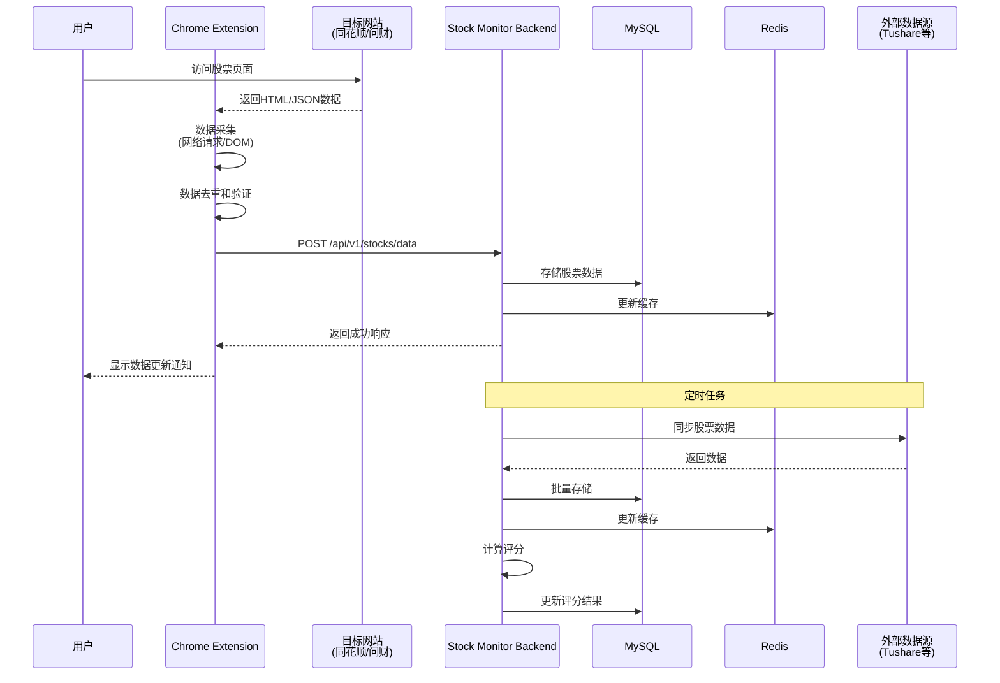
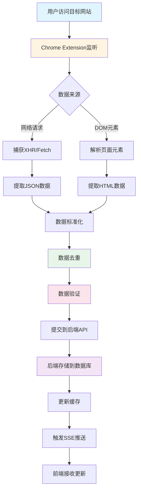
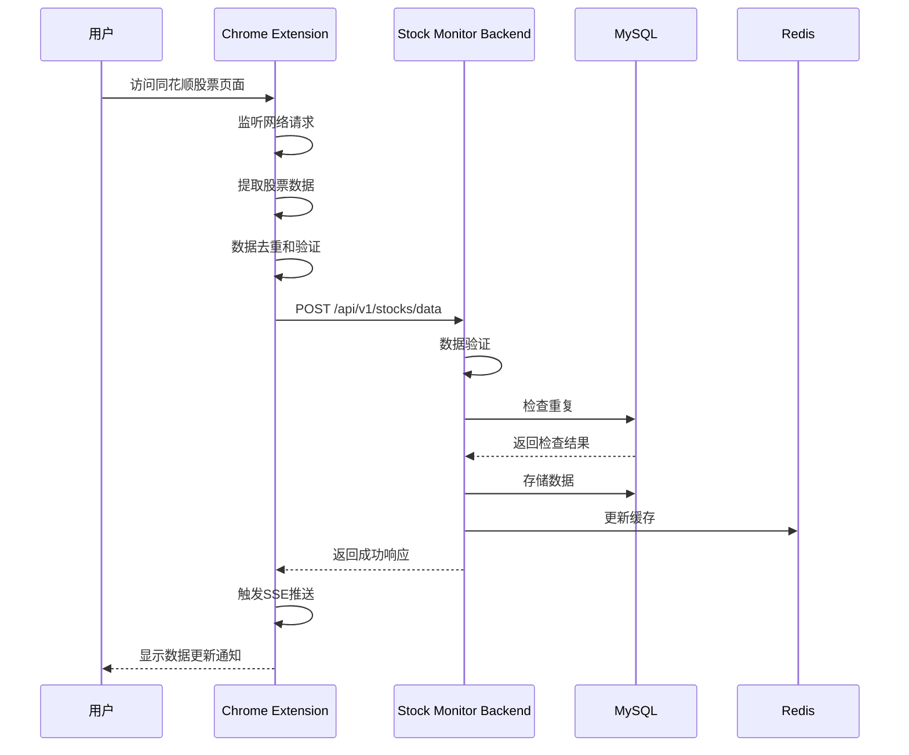
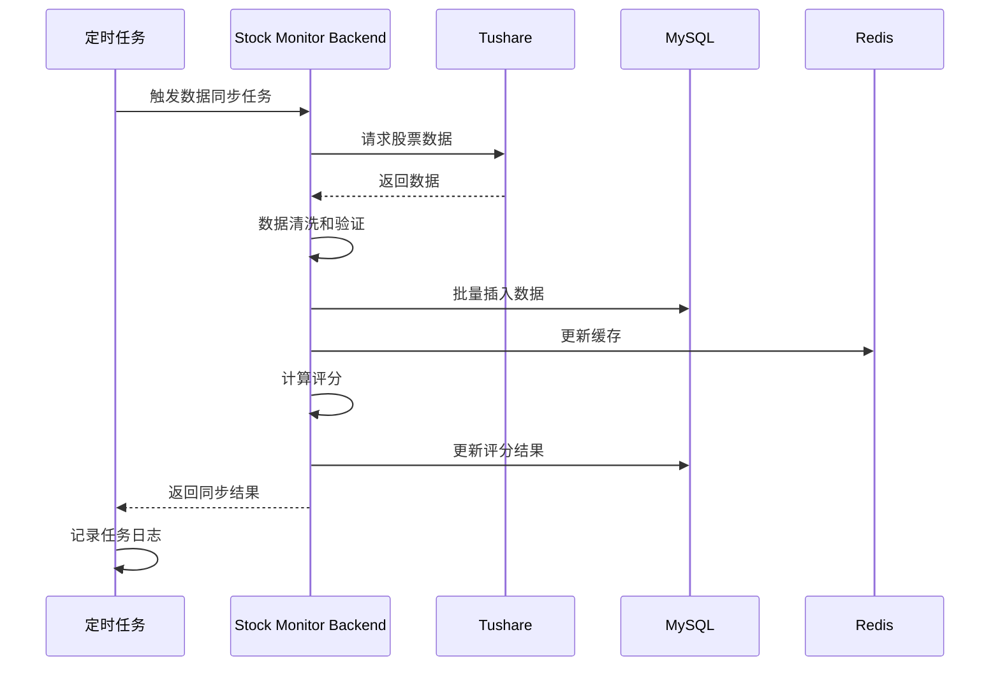

# Event-Crawler 数据流转架构

## 1. 概述

本文档详细描述Event-Crawler系统的完整数据流转过程，包括从浏览器环境到后端API的数据流、各模块间的接口定义、消息格式规范、数据校验和去重机制、错误处理和重试策略。

**项目位置**: `/Users/mac/StudioProjects/open-citycloud/projects/event-crawler`

**文档版本**: V1.0  
**最后更新**: 2026-01-08

---

## 2. 完整数据流图

### 2.1 整体数据流



### 2.2 数据采集流程



---

## 3. HTTP API接口规范

### 3.1 基础信息

- **基础URL**: `http://localhost:8000`
- **API版本**: `v1`
- **API前缀**: `/api/v1`
- **内容类型**: `application/json`
- **字符编码**: `UTF-8`

### 3.2 通用请求格式

#### 3.2.1 请求头

```http
Content-Type: application/json
Accept: application/json
User-Agent: Chrome-Extension/1.0.0
```

#### 3.2.2 请求体格式

```json
{
  "data": {
    // 具体业务数据
  },
  "metadata": {
    "timestamp": "2024-01-15T10:30:00Z",
    "source": "chrome-extension",
    "version": "1.0.0"
  }
}
```

### 3.3 通用响应格式

#### 3.3.1 成功响应

```json
{
  "success": true,
  "data": {
    // 响应数据
  },
  "message": "操作成功",
  "timestamp": "2024-01-15T10:30:00Z"
}
```

#### 3.3.2 错误响应

```json
{
  "error": true,
  "message": "错误描述",
  "code": 400,
  "path": "/api/v1/stocks/data",
  "details": [
    {
      "field": "code",
      "message": "股票代码格式错误",
      "value": "000001"
    }
  ],
  "timestamp": "2024-01-15T10:30:00Z"
}
```

### 3.4 核心API接口

#### 3.4.1 股票数据提交

**端点**: `POST /api/v1/stocks/data`

**描述**: 提交单条股票数据

**请求体**:
```json
{
  "code": "000001",
  "name": "平安银行",
  "current_price": 12.50,
  "open_price": 12.30,
  "prev_close": 12.40,
  "change_amount": 0.10,
  "volume": 1000000,
  "timestamp": "2024-01-15T10:30:00Z"
}
```

**请求参数**:

| 字段 | 类型 | 必填 | 说明 | 示例 |
|------|------|------|------|------|
| code | string | 是 | 股票代码 | "000001" |
| name | string | 是 | 股票名称 | "平安银行" |
| current_price | number | 是 | 当前价格 | 12.50 |
| open_price | number | 否 | 开盘价 | 12.30 |
| prev_close | number | 否 | 昨收价 | 12.40 |
| change_amount | number | 否 | 涨跌额 | 0.10 |
| volume | integer | 否 | 成交量 | 1000000 |
| timestamp | string | 否 | 数据时间戳(ISO 8601) | "2024-01-15T10:30:00Z" |

**响应示例**:
```json
{
  "success": true,
  "data": {
    "id": 12345,
    "code": "000001",
    "name": "平安银行",
    "current_price": 12.50,
    "created_at": "2024-01-15T10:30:00Z"
  },
  "message": "股票数据提交成功",
  "timestamp": "2024-01-15T10:30:00Z"
}
```

#### 3.4.2 批量股票数据提交

**端点**: `POST /api/v1/stocks/data/batch`

**描述**: 批量提交股票数据

**请求体**:
```json
{
  "data": [
    {
      "code": "000001",
      "name": "平安银行",
      "current_price": 12.50,
      "open_price": 12.30,
      "prev_close": 12.40,
      "change_amount": 0.10,
      "volume": 1000000,
      "timestamp": "2024-01-15T10:30:00Z"
    },
    {
      "code": "000002",
      "name": "万科A",
      "current_price": 25.68,
      "open_price": 25.50,
      "prev_close": 25.60,
      "change_amount": 0.08,
      "volume": 2000000,
      "timestamp": "2024-01-15T10:30:00Z"
    }
  ]
}
```

**响应示例**:
```json
{
  "success": true,
  "data": {
    "total": 2,
    "success": 2,
    "failed": 0,
    "errors": [],
    "duplicates": 0
  },
  "message": "批量提交完成",
  "timestamp": "2024-01-15T10:30:00Z"
}
```

#### 3.4.3 获取股票信息

**端点**: `GET /api/v1/stocks/info/{stock_code}`

**描述**: 获取指定股票的基本信息

**路径参数**:

| 参数 | 类型 | 说明 | 示例 |
|------|------|------|------|
| stock_code | string | 股票代码 | "000001" |

**响应示例**:
```json
{
  "success": true,
  "data": {
    "code": "000001",
    "name": "平安银行",
    "market": "SZ",
    "industry": "银行",
    "is_active": true,
    "latest_price": 12.50,
    "volume_anomaly_score": 1500,
    "created_at": "2024-01-15T10:30:00Z",
    "updated_at": "2024-01-15T10:30:00Z"
  },
  "message": "获取股票信息成功",
  "timestamp": "2024-01-15T10:30:00Z"
}
```

#### 3.4.4 获取监控列表

**端点**: `GET /api/v1/monitors`

**描述**: 获取监控股票列表

**查询参数**:

| 参数 | 类型 | 必填 | 默认值 | 说明 |
|------|------|------|--------|------|
| active_only | boolean | 否 | true | 仅活跃监控 |
| priority_filter | integer | 否 | - | 优先级过滤(1-10) |
| include_stock_info | boolean | 否 | false | 包含股票信息 |
| include_latest_data | boolean | 否 | false | 包含最新数据 |
| limit | integer | 否 | 100 | 每页数量 |
| offset | integer | 否 | 0 | 偏移量 |

**响应示例**:
```json
{
  "success": true,
  "data": {
    "items": [
      {
        "code": "000001",
        "priority": 1,
        "is_active": true,
        "stock_info": {
          "name": "平安银行",
          "market": "SZ",
          "industry": "银行"
        },
        "latest_data": {
          "current_price": 12.50,
          "change_amount": 0.10,
          "volume": 1000000
        }
      }
    ],
    "total": 1,
    "limit": 100,
    "offset": 0,
    "has_more": false
  },
  "message": "获取监控列表成功",
  "timestamp": "2024-01-15T10:30:00Z"
}
```

---

## 4. SSE实时推送机制

### 4.1 SSE端点

**端点**: `GET /api/v1/crawler/events`

**描述**: SSE实时更新端点，用于推送爬虫状态、股票数据更新等事件

### 4.2 SSE事件类型

| 事件类型 | 说明 | 数据格式 |
|---------|------|---------|
| `crawler_status` | 爬虫状态更新 | `{platform, status, message, data_count, error}` |
| `login_failed` | 登录失败事件 | `{platform, message}` |
| `stock_data_update` | 股票数据更新 | `{code, price, change_percent, volume, ...}` |
| `batch_completed` | 批次完成事件 | `{batch_id, total_records, success_records, failed_records}` |
| `monitor_alert` | 监控告警事件 | `{code, alert_type, message, data}` |

### 4.3 SSE消息格式

```json
{
  "event": "crawler_status",
  "data": "{\"platform\":\"wencai\",\"status\":\"running\",\"message\":\"正在抓取...\",\"data_count\":150}",
  "timestamp": "2024-01-15T10:30:00Z"
}
```

### 4.4 SSE客户端订阅示例

```javascript
const eventSource = new EventSource('http://localhost:8000/api/v1/crawler/events');

eventSource.onmessage = (event) => {
  const data = JSON.parse(event.data);
  console.log('Event:', data.event);
  console.log('Data:', JSON.parse(data.data));
};

eventSource.addEventListener('crawler_status', (event) => {
  const data = JSON.parse(event.data);
  console.log('Crawler Status:', data);
});

eventSource.onerror = (error) => {
  console.error('SSE Error:', error);
  eventSource.close();
};
```

### 4.5 SSE服务端广播

```python
async def broadcast(self, event_type: str, data: Dict[str, Any]):
    """
    Broadcast message to all connected clients
    
    Args:
        event_type: 事件类型
        data: 事件数据
    """
    message = {
        "event": event_type,
        "data": json.dumps(data),
        "timestamp": datetime.now().isoformat()
    }
    
    for queue in self.clients:
        await queue.put(message)
```

### 4.6 SSE连接管理

- **客户端列表**: `List[asyncio.Queue]`
- **连接建立**: 自动添加到clients列表
- **连接断开**: 自动从clients列表移除
- **消息广播**: 向所有clients推送消息
- **错误处理**: 捕获CancelledError，清理资源

---

## 5. 数据校验和去重机制

### 5.1 数据校验

#### 5.1.1 前端数据校验

**校验规则**:
```typescript
interface StockDataValidation {
  code: string;        // 必须是6位数字
  name: string;        // 非空字符串
  current_price: number; // 必须大于0
  volume: number;      // 必须大于等于0
  timestamp: string;    // 必须是有效的ISO 8601格式
}

function validateStockData(data: StockDataValidation): boolean {
  // 股票代码校验
  if (!/^\d{6}$/.test(data.code)) {
    throw new Error('股票代码格式错误');
  }
  
  // 价格校验
  if (data.current_price <= 0) {
    throw new Error('当前价格必须大于0');
  }
  
  // 成交量校验
  if (data.volume < 0) {
    throw new Error('成交量不能为负数');
  }
  
  // 时间戳校验
  if (!isValidISO8601(data.timestamp)) {
    throw new Error('时间戳格式错误');
  }
  
  return true;
}
```

#### 5.1.2 后端数据校验

**Pydantic模型**:
```python
from pydantic import BaseModel, Field, validator
from datetime import datetime

class StockDataCreate(BaseModel):
    code: str = Field(..., regex=r'^\d{6}$', description="股票代码")
    name: str = Field(..., min_length=1, max_length=100, description="股票名称")
    current_price: float = Field(..., gt=0, description="当前价格")
    open_price: float = Field(None, ge=0, description="开盘价")
    prev_close: float = Field(None, ge=0, description="昨收价")
    change_amount: float = Field(None, description="涨跌额")
    volume: int = Field(None, ge=0, description="成交量")
    timestamp: datetime = Field(default_factory=datetime.now, description="数据时间戳")
    
    @validator('code')
    def validate_code(cls, v):
        if not v:
            raise ValueError('股票代码不能为空')
        return v
    
    @validator('current_price')
    def validate_price(cls, v):
        if v <= 0:
            raise ValueError('当前价格必须大于0')
        return v
```

### 5.2 数据去重

#### 5.2.1 时间窗口去重

**算法**:
```typescript
export class DataDeduplicationOptimizer {
  static deduplicateStockData(
    data: TimestampedStockData[],
    config: DeduplicationConfig = {}
  ): DeduplicationResult {
    const timeWindowMs = config.timeWindowMs || 60000; // 默认1分钟
    const strategy = config.strategy || 'highest_quality';
    
    const groups = new Map<string, TimestampedStockData[]>();
    
    // 按股票代码分组
    data.forEach(item => {
      if (!groups.has(item.code)) {
        groups.set(item.code, []);
      }
      groups.get(item.code)!.push(item);
    });
    
    const deduplicated: TimestampedStockData[] = [];
    let duplicatesRemoved = 0;
    
    // 对每只股票进行去重
    for (const [code, items] of groups.entries()) {
      if (items.length === 1) {
        deduplicated.push(items[0]);
        continue;
      }
      
      // 按时间窗口分组
      const windows = this.groupByTimeWindow(items, timeWindowMs);
      
      // 根据策略选择最佳数据
      windows.forEach(windowItems => {
        const bestItem = this.selectBestItem(windowItems, strategy);
        deduplicated.push(bestItem);
        duplicatesRemoved += windowItems.length - 1;
      });
    }
    
    return {
      deduplicated,
      duplicatesRemoved,
      qualityImproved: 0
    };
  }
  
  private static groupByTimeWindow(
    items: TimestampedStockData[],
    windowMs: number
  ): TimestampedStockData[][] {
    const windows: TimestampedStockData[][] = [];
    let currentWindow: TimestampedStockData[] = [];
    let windowStart = items[0]?.timestamp || 0;
    
    items.forEach(item => {
      if (item.timestamp - windowStart <= windowMs) {
        currentWindow.push(item);
      } else {
        windows.push(currentWindow);
        currentWindow = [item];
        windowStart = item.timestamp;
      }
    });
    
    if (currentWindow.length > 0) {
      windows.push(currentWindow);
    }
    
    return windows;
  }
  
  private static selectBestItem(
    items: TimestampedStockData[],
    strategy: string
  ): TimestampedStockData {
    switch (strategy) {
      case 'highest_quality':
        return items.reduce((best, current) => 
          current.quality > best.quality ? current : best
        );
      case 'latest':
        return items.reduce((latest, current) => 
          current.timestamp > latest.timestamp ? current : latest
        );
      default:
        return items[0];
    }
  }
}
```

#### 5.2.2 SHA256哈希去重

**后端实现**:
```python
import hashlib
import json

def generate_data_hash(data: dict, hash_fields: list) -> str:
    """
    生成数据的SHA256哈希值
    
    Args:
        data: 原始数据
        hash_fields: 参与哈希计算的字段列表
        
    Returns:
        SHA256哈希值
    """
    # 提取参与哈希计算的字段
    hash_data = {k: data.get(k) for k in hash_fields if k in data}
    
    # 转换为JSON字符串并排序
    json_str = json.dumps(hash_data, sort_keys=True)
    
    # 生成SHA256哈希
    hash_value = hashlib.sha256(json_str.encode('utf-8')).hexdigest()
    
    return hash_value

def check_duplicate(table_name: str, data_hash: str) -> bool:
    """
    检查数据是否重复
    
    Args:
        table_name: 表名
        data_hash: 数据哈希值
        
    Returns:
        True表示重复，False表示不重复
    """
    from app.models.data_dedup_log import DataDedupLog
    
    existing = DataDedupLog.query.filter_by(
        table_name=table_name,
        data_hash=data_hash
    ).first()
    
    return existing is not None
```

---

## 6. 错误处理和重试策略

### 6.1 错误分类

| 错误类型 | HTTP状态码 | 说明 | 处理策略 |
|---------|-----------|------|---------|
| 参数验证错误 | 400 | 请求参数格式错误 | 不重试，返回错误信息 |
| 认证错误 | 401 | 未授权 | 不重试，提示用户登录 |
| 权限错误 | 403 | 无权限访问 | 不重试，返回错误信息 |
| 资源不存在 | 404 | 请求的资源不存在 | 不重试，返回错误信息 |
| 限流错误 | 429 | 请求频率过高 | 延迟重试 |
| 服务器错误 | 500 | 服务器内部错误 | 重试3次 |
| 网络错误 | N/A | 网络连接失败 | 指数退避重试 |

### 6.2 重试策略

#### 6.2.1 指数退避重试

```typescript
async function retryWithBackoff<T>(
  fn: () => Promise<T>,
  maxRetries: number = 3,
  baseDelay: number = 1000
): Promise<T> {
  let lastError: Error;
  
  for (let attempt = 0; attempt <= maxRetries; attempt++) {
    try {
      return await fn();
    } catch (error) {
      lastError = error as Error;
      
      // 判断是否需要重试
      if (!shouldRetry(error)) {
        throw error;
      }
      
      // 计算延迟时间（指数退避）
      const delay = baseDelay * Math.pow(2, attempt);
      
      console.log(`Retry attempt ${attempt + 1}/${maxRetries}, delay: ${delay}ms`);
      
      await sleep(delay);
    }
  }
  
  throw lastError;
}

function shouldRetry(error: Error): boolean {
  // HTTP错误码
  if (error instanceof HttpError) {
    const status = error.status;
    return status >= 500 || status === 429;
  }
  
  // 网络错误
  if (error instanceof NetworkError) {
    return true;
  }
  
  return false;
}
```

#### 6.2.2 Python重试装饰器

```python
import asyncio
from functools import wraps
from typing import Callable, Type
from loguru import logger

def async_retry(
  max_retries: int = 3,
  base_delay: float = 1.0,
  exceptions: tuple[Type[Exception], ...] = (Exception,)
):
  """
  异步重试装饰器
    
  Args:
      max_retries: 最大重试次数
      base_delay: 基础延迟时间（秒）
      exceptions: 需要重试的异常类型
  """
  def decorator(func: Callable):
    @wraps(func)
    async def wrapper(*args, **kwargs):
      last_exception = None
      
      for attempt in range(max_retries):
        try:
          return await func(*args, **kwargs)
        except exceptions as e:
          last_exception = e
          
          # 判断是否需要重试
          if not should_retry(e):
            raise
          
          # 计算延迟时间（指数退避）
          delay = base_delay * (2 ** attempt)
          
          logger.warning(
            f"重试 {attempt + 1}/{max_retries}, "
            f"延迟: {delay}秒, 错误: {str(e)}"
          )
          
          await asyncio.sleep(delay)
      
      # 所有重试都失败，抛出最后一个异常
      raise last_exception
    
    return wrapper
  return decorator

def should_retry(exception: Exception) -> bool:
  """
  判断异常是否需要重试
  
  Args:
      exception: 异常对象
      
  Returns:
      True表示需要重试，False表示不需要重试
  """
  # HTTP错误
  if hasattr(exception, 'status'):
    status = getattr(exception, 'status')
    return status >= 500 or status == 429
  
  # 网络错误
  if isinstance(exception, (ConnectionError, TimeoutError)):
    return True
  
  return False
```

### 6.3 错误日志记录

```python
from loguru import logger
from datetime import datetime

def log_error(error: Exception, context: dict = None):
  """
  记录错误日志
  
  Args:
      error: 异常对象
      context: 上下文信息
  """
  error_info = {
    'timestamp': datetime.now().isoformat(),
    'error_type': type(error).__name__,
    'error_message': str(error),
    'context': context or {}
  }
  
  logger.error(f"Error occurred: {error_info}")

# 使用示例
try:
  await some_operation()
except Exception as e:
  log_error(e, context={
    'operation': 'some_operation',
    'user_id': '12345'
  })
```

---

## 7. 数据流转示例

### 7.1 股票数据采集流程



### 7.2 批量数据同步流程



---

## 8. 性能优化

### 8.1 数据库优化

**索引策略**:
```sql
-- 股票数据表索引
CREATE INDEX idx_stock_prices_code ON stock_prices(code);
CREATE INDEX idx_stock_prices_timestamp ON stock_prices(timestamp);
CREATE INDEX idx_stock_prices_code_timestamp ON stock_prices(code, timestamp);

-- 去重日志表索引
CREATE UNIQUE INDEX uk_dedup_table_hash ON data_dedup_log(table_name, data_hash);
```

**查询优化**:
```python
# 使用批量插入代替单条插入
async def batch_insert_stock_data(session: AsyncSession, data_list: List[StockData]):
  """
  批量插入股票数据
  """
  session.bulk_save_objects(data_list)
  await session.commit()

# 使用JOIN查询代替多次查询
async def get_stock_with_monitor(session: AsyncSession, code: str):
  """
  获取股票及其监控信息
  """
  result = await session.execute(
    select(StockInfo, MonitorList)
    .join(MonitorList, StockInfo.code == MonitorList.code)
    .where(StockInfo.code == code)
  )
  return result.fetchone()
```

### 8.2 缓存策略

```python
from redis import Redis
import json
from datetime import timedelta

redis_client = Redis(host='localhost', port=6379, db=0)

async def get_stock_info(code: str) -> dict:
  """
  获取股票信息（带缓存）
  """
  cache_key = f"stock:info:{code}"
  
  # 尝试从缓存获取
  cached = redis_client.get(cache_key)
  if cached:
    return json.loads(cached)
  
  # 从数据库查询
  stock_info = await db.query(StockInfo).filter_by(code=code).first()
  
  # 写入缓存（1小时过期）
  redis_client.setex(
    cache_key,
    timedelta(hours=1).seconds,
    json.dumps(stock_info.to_dict())
  )
  
  return stock_info.to_dict()
```

---

## 9. 总结

本文档详细描述了Event-Crawler系统的数据流转过程，包括：

1. **完整数据流**: 从浏览器采集到后端存储的完整流程
2. **HTTP API接口**: 核心API接口的定义和规范
3. **SSE实时推送**: 实时事件推送机制
4. **数据校验**: 前端和后端的数据校验规则
5. **数据去重**: 时间窗口去重和SHA256哈希去重
6. **错误处理**: 错误分类和重试策略
7. **性能优化**: 数据库和缓存优化策略

所有接口都遵循统一的请求/响应格式，包含完善的错误处理机制，支持数据校验、去重、限流等功能。

---

**文档维护**: 本文档应随着API接口的演进而持续更新，确保与实际接口保持一致。
