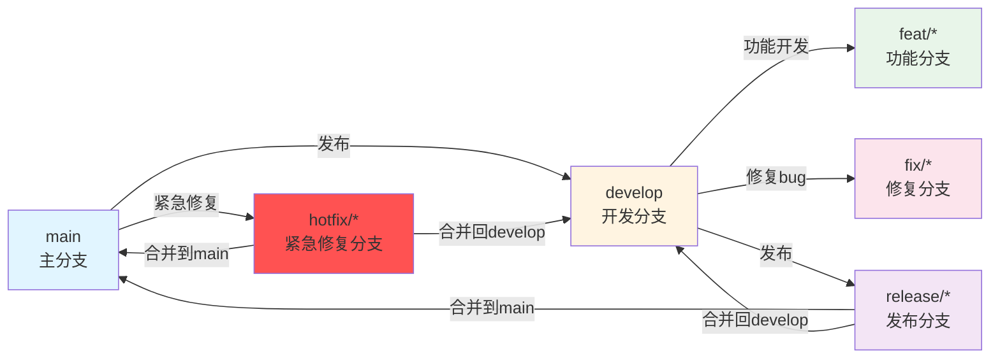
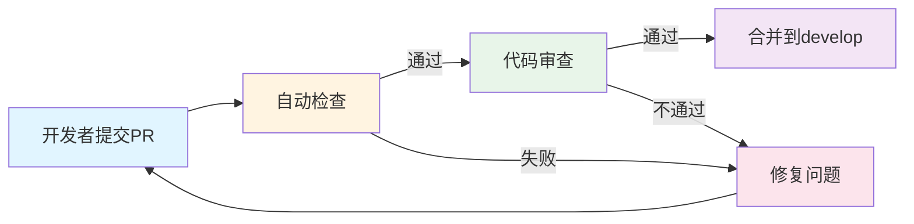
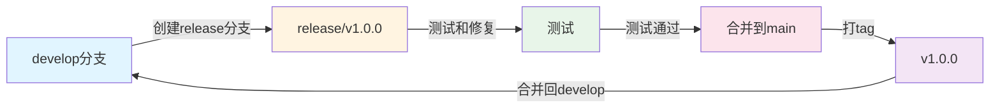
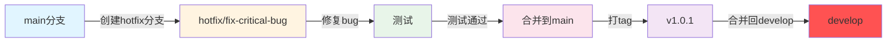

# Event-Crawler 开发流程

## 1. 概述

本文档详细描述Event-Crawler项目的开发流程，包括分支管理策略、提交规范、代码审查流程、Pull Request模板、发布流程和Hotfix流程。

**项目位置**: `/Users/mac/StudioProjects/open-citycloud/projects/event-crawler`  
**文档版本**: V1.0  
**最后更新**: 2026-01-08

---

## 2. 分支管理策略

### 2.1 Git Flow模型



### 2.2 分支说明

| 分支类型 | 命名规范 | 说明 | 合并目标 |
|---------|----------|------|----------|
| **main** | main | 主分支，用于生产环境 | - |
| **develop** | develop | 开发分支，用于集成开发 | - |
| **feature** | feat/功能描述 | 功能开发分支 | develop |
| **bugfix** | fix/问题描述 | Bug修复分支 | develop |
| **release** | release/版本号 | 发布准备分支 | main, develop |
| **hotfix** | hotfix/问题描述 | 紧急修复分支 | main, develop |

### 2.3 分支命名示例

```bash
# 功能分支
feat/add-stock-monitor
feat/implement-data-deduplication
feat/add-sse-push

# Bug修复分支
fix/fix-login-error
fix/fix-data-parsing
fix/fix-memory-leak

# 发布分支
release/v1.0.0
release/v1.1.0

# 紧急修复分支
hotfix/fix-critical-bug
hotfix/fix-security-issue
```

---

## 3. 提交规范

### 3.1 Conventional Commits规范

#### 3.1.1 提交信息格式

```
<type>(<scope>): <subject>

<body>

<footer>
```

#### 3.1.2 Type类型

| Type | 说明 | 示例 |
|------|------|------|
| **feat** | 新功能 | feat: 添加股票监控功能 |
| **fix** | 修复Bug | fix: 修复数据去重问题 |
| **docs** | 文档更新 | docs: 更新API文档 |
| **style** | 代码格式（不影响功能） | style: 格式化代码 |
| **refactor** | 重构（不是新功能也不是修复） | refactor: 重构数据访问层 |
| **perf** | 性能优化 | perf: 优化数据库查询 |
| **test** | 测试相关 | test: 添加单元测试 |
| **chore** | 构建/工具相关 | chore: 更新依赖版本 |

#### 3.1.3 Scope范围

| Scope | 说明 | 示例 |
|-------|------|------|
| **api** | API相关 | feat(api): 添加股票信息API |
| **ui** | UI相关 | feat(ui): 添加监控列表页面 |
| **db** | 数据库相关 | feat(db): 添加股票数据表 |
| **service** | 服务层相关 | feat(service): 添加数据同步服务 |
| **utils** | 工具类相关 | feat(utils): 添加数据去重工具 |

#### 3.1.4 提交信息示例

```bash
# 简单提交
feat: 添加股票监控功能

# 带scope的提交
feat(api): 添加股票信息API

# 带body的提交
feat: 添加股票监控功能

- 添加实时监控功能
- 添加告警规则配置
- 添加监控历史记录

# 带footer的提交
feat: 添加股票监控功能

- 添加实时监控功能
- 添加告警规则配置

Closes #123

# 完整的提交
feat(monitor): 添加实时股票监控功能

添加实时股票监控功能，支持自定义告警规则。

- 添加实时监控功能
- 添加告警规则配置
- 添加监控历史记录
- 优化监控性能

Closes #123
```

### 3.2 提交最佳实践

#### 3.2.1 提交粒度

```bash
# 好的示例：每个提交只做一件事
git commit -m "feat: 添加股票监控功能"
git commit -m "feat: 添加告警规则配置"
git commit -m "feat: 添加监控历史记录"

# 不好的示例：一个提交包含多个功能
git commit -m "feat: 添加股票监控功能、告警规则配置、监控历史记录"
```

#### 3.2.2 提交信息长度

```bash
# 好的示例：Subject不超过50个字符
git commit -m "feat: 添加股票监控功能"

# 不好的示例：Subject过长
git commit -m "feat: 添加一个全新的股票监控功能，支持实时监控、告警规则配置和历史记录"
```

#### 3.2.3 使用祈使句

```bash
# 好的示例：使用祈使句
git commit -m "feat: 添加股票监控功能"
git commit -m "fix: 修复数据去重问题"
git commit -m "docs: 更新API文档"

# 不好的示例：使用过去式
git commit -m "feat: 添加了股票监控功能"
git commit -m "fix: 修复了数据去重问题"
git commit -m "docs: 更新了API文档"
```

---

## 4. 代码审查流程

### 4.1 Pull Request创建

#### 4.1.1 PR模板

```markdown
## 描述
简要描述这个PR的目的和内容。

## 变更类型
- [ ] 新功能
- [ ] Bug修复
- [ ] 代码重构
- [ ] 文档更新
- [ ] 性能优化
- [ ] 其他

## 测试
- [ ] 已添加单元测试
- [ ] 已添加集成测试
- [ ] 已手动测试
- [ ] 所有测试通过

## 检查清单
- [ ] 代码遵循项目编码规范
- [ ] 已添加必要的文档
- [ ] 已更新相关文档
- [ ] 无console.log或debug代码
- [ ] 无TODO或FIXME

## 相关Issue
Closes #123
Related to #456

## 截图
（如果适用，添加截图）
```

#### 4.1.2 PR标题格式

```bash
# 好的示例：使用Conventional Commits格式
feat: 添加股票监控功能
fix: 修复数据去重问题
docs: 更新API文档

# 不好的示例：缺少类型或描述不清
添加股票监控功能
修复bug
更新文档
```

### 4.2 代码审查检查清单

#### 4.2.1 功能检查

- [ ] 功能是否按照需求实现
- [ ] 边界条件是否处理
- [ ] 错误处理是否完善
- [ ] 日志记录是否充分

#### 4.2.2 代码质量检查

- [ ] 代码是否遵循项目编码规范
- [ ] 命名是否清晰易懂
- [ ] 注释是否充分且准确
- [ ] 代码复杂度是否合理
- [ ] 是否有代码重复

#### 4.2.3 性能检查

- [ ] 是否有性能问题
- [ ] 数据库查询是否优化
- [ ] 是否有内存泄漏
- [ ] 是否有不必要的计算

#### 4.2.4 安全检查

- [ ] 是否有安全漏洞
- [ ] 敏感信息是否加密
- [ ] 输入验证是否完善
- [ ] SQL注入防护是否到位

#### 4.2.5 测试检查

- [ ] 单元测试是否覆盖核心逻辑
- [ ] 集成测试是否覆盖关键流程
- [ ] 测试用例是否充分
- [ ] 所有测试是否通过

### 4.3 代码审查流程



#### 4.3.1 自动检查

```yaml
# .github/workflows/pr-check.yml
name: PR Check

on:
  pull_request:
    branches: [develop]

jobs:
  check:
    runs-on: ubuntu-latest
    steps:
      - uses: actions/checkout@v3
      
      - name: Setup Node.js
        uses: actions/setup-node@v3
        with:
          node-version: '18'
      
      - name: Install dependencies
        run: npm install
      
      - name: Run lint
        run: npm run lint
      
      - name: Run tests
        run: npm run test
      
      - name: Check coverage
        run: npm run test:coverage
```

#### 4.3.2 人工审查

1. **审查者选择**: 至少1名开发者进行审查
2. **审查时间**: 提交PR后24小时内开始审查
3. **审查反馈**: 提供具体的修改建议
4. **审查通过**: 所有检查项都通过后批准合并

---

## 5. 发布流程

### 5.1 版本号规范

#### 5.1.1 语义化版本

```
MAJOR.MINOR.PATCH

MAJOR: 不兼容的API修改
MINOR: 向下兼容的功能性新增
PATCH: 向下兼容的问题修正
```

#### 5.1.2 版本号示例

| 版本号 | 说明 | 示例 |
|--------|------|------|
| **1.0.0** | 初始版本 | v1.0.0 |
| **1.1.0** | 新增功能 | v1.1.0 |
| **1.1.1** | 修复Bug | v1.1.1 |
| **2.0.0** | 重大更新 | v2.0.0 |

### 5.2 发布流程



#### 5.2.1 创建发布分支

```bash
# 从develop分支创建发布分支
git checkout develop
git pull origin develop
git checkout -b release/v1.0.0

# 更新版本号
# 更新package.json中的version字段
# 更新CHANGELOG.md
```

#### 5.2.2 测试发布分支

```bash
# 运行完整测试套件
npm run test
python -m pytest

# 进行手动测试
# 测试所有核心功能
# 测试边界条件
# 测试错误处理
```

#### 5.2.3 合并到main

```bash
# 合并到main分支
git checkout main
git pull origin main
git merge release/v1.0.0

# 创建tag
git tag -a v1.0.0 -m "Release version 1.0.0"

# 推送到远程
git push origin main
git push origin v1.0.0
```

#### 5.2.4 合并回develop

```bash
# 合并回develop分支
git checkout develop
git pull origin develop
git merge release/v1.0.0

# 推送到远程
git push origin develop
```

### 5.3 发布说明

#### 5.3.1 CHANGELOG模板

```markdown
# Changelog

All notable changes to this project will be documented in this file.

The format is based on [Keep a Changelog](https://keepachangelog.com/en/1.0.0/),
and this project adheres to [Semantic Versioning](https://semver.org/spec/v2.0.0.html).

## [1.0.0] - 2024-01-15

### Added
- 添加股票监控功能
- 添加告警规则配置
- 添加监控历史记录

### Changed
- 重构数据访问层
- 优化数据库查询性能

### Fixed
- 修复数据去重问题
- 修复登录错误

### Security
- 修复SQL注入漏洞

## [0.9.0] - 2024-01-01

### Added
- 初始版本
```

---

## 6. Hotfix流程

### 6.1 Hotfix流程图



### 6.2 Hotfix流程

#### 6.2.1 创建Hotfix分支

```bash
# 从main分支创建hotfix分支
git checkout main
git pull origin main
git checkout -b hotfix/fix-critical-bug

# 修复bug
# ... 编写代码 ...
```

#### 6.2.2 测试Hotfix

```bash
# 运行测试
npm run test
python -m pytest

# 进行手动测试
# 测试修复的功能
# 测试相关功能
```

#### 6.2.3 合并到main

```bash
# 合并到main分支
git checkout main
git pull origin main
git merge hotfix/fix-critical-bug

# 创建tag
git tag -a v1.0.1 -m "Hotfix version 1.0.1"

# 推送到远程
git push origin main
git push origin v1.0.1
```

#### 6.2.4 合并回develop

```bash
# 合并回develop分支
git checkout develop
git pull origin develop
git merge hotfix/fix-critical-bug

# 推送到远程
git push origin develop
```

---

## 7. 总结

本文档详细描述了Event-Crawler项目的开发流程，包括：

1. **分支管理策略**: Git Flow模型、分支说明、分支命名示例
2. **提交规范**: Conventional Commits规范、Type类型、Scope范围、提交示例、提交最佳实践
3. **代码审查流程**: PR模板、PR标题格式、代码审查检查清单、自动检查、人工审查
4. **发布流程**: 版本号规范、发布流程、CHANGELOG模板
5. **Hotfix流程**: Hotfix流程图、Hotfix流程步骤

遵循这些开发流程可以确保代码质量、团队协作效率和项目稳定性。

---

**文档维护**: 本文档应随着项目开发流程的演进而持续更新，确保与实际开发实践保持一致。
