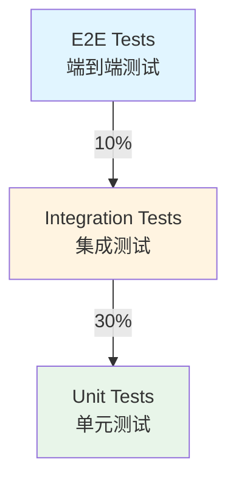

# Event-Crawler 测试策略

## 1. 概述

本文档详细描述Event-Crawler项目的测试策略，包括测试金字塔、测试框架使用指南、测试覆盖率要求、Mock和Stub使用规范、性能测试策略和测试数据管理。

**项目位置**: `/Users/mac/StudioProjects/open-citycloud/projects/event-crawler`  
**文档版本**: V1.0  
**最后更新**: 2026-01-08

---

## 2. 测试金字塔

### 2.1 测试金字塔图



### 2.2 测试类型说明

| 测试类型 | 占比 | 说明 | 示例 |
|---------|------|------|------|
| **单元测试** | 70% | 测试单个函数或方法 | 测试数据去重函数 |
| **集成测试** | 20% | 测试多个模块的交互 | 测试API端点 |
| **E2E测试** | 10% | 测试完整用户流程 | 测试股票监控流程 |

---

## 3. 测试框架使用指南

### 3.1 Python测试框架

#### 3.1.1 pytest配置

**pytest.ini**:
```ini
[pytest]
testpaths = tests
python_files = test_*.py
python_classes = Test*
python_functions = test_*

markers =
    unit: 单元测试
    integration: 集成测试
    slow: 慢速测试
    database: 需要数据库的测试
    api: API测试
    service: 服务层测试
    repository: 数据访问层测试
    model: 模型测试

addopts =
    -v
    --strict-markers
    --tb=short
    --cov=app
    --cov-report=html
    --cov-report=term-missing
    --cov-fail-under=80
```

#### 3.1.2 单元测试示例

```python
# tests/unit/test_data_utils.py
import pytest
from app.utils.data_utils import calculate_hash, deduplicate_data

class TestDataUtils:
    """测试数据工具类"""
    
    def test_calculate_hash(self):
        """测试哈希计算"""
        data = {"code": "000001", "price": 12.50}
        hash_value = calculate_hash(data)
        
        assert isinstance(hash_value, str)
        assert len(hash_value) == 64  # SHA256哈希长度
    
    def test_deduplicate_data(self):
        """测试数据去重"""
        data = [
            {"code": "000001", "price": 12.50},
            {"code": "000001", "price": 12.50},  # 重复数据
            {"code": "000002", "price": 25.68}
        ]
        
        result = deduplicate_data(data)
        
        assert len(result) == 2
        assert result[0]["code"] == "000001"
        assert result[1]["code"] == "000002"
```

#### 3.1.3 集成测试示例

```python
# tests/integration/test_stock_api.py
import pytest
from fastapi.testclient import TestClient
from app.main import app

class TestStockAPI:
    """测试股票API"""
    
    @pytest.fixture
    def client(self):
        """创建测试客户端"""
        return TestClient(app)
    
    def test_get_stock_info(self, client):
        """测试获取股票信息"""
        response = client.get("/api/v1/stocks/info/000001")
        
        assert response.status_code == 200
        data = response.json()
        assert data["success"] is True
        assert data["data"]["code"] == "000001"
    
    def test_create_stock_info(self, client):
        """测试创建股票信息"""
        stock_data = {
            "code": "000003",
            "name": "测试股票",
            "market": "SZ",
            "industry": "测试行业"
        }
        
        response = client.post("/api/v1/stocks/info", json=stock_data)
        
        assert response.status_code == 200
        data = response.json()
        assert data["success"] is True
        assert data["data"]["code"] == "000003"
```

#### 3.1.4 数据库测试示例

```python
# tests/integration/test_stock_repository.py
import pytest
from sqlalchemy import create_engine
from sqlalchemy.orm import sessionmaker
from app.models.stock import StockInfo
from app.repositories.stock_repository import StockRepository

@pytest.fixture
def db_session():
    """创建测试数据库会话"""
    engine = create_engine("sqlite:///:memory:")
    TestingSessionLocal = sessionmaker(autocommit=False, autoflush=False, bind=engine)
    StockInfo.metadata.create_all(bind=engine)
    
    session = TestingSessionLocal()
    try:
        yield session
    finally:
        session.close()
        engine.dispose()

class TestStockRepository:
    """测试股票数据访问层"""
    
    def test_get_stock_by_code(self, db_session):
        """测试通过代码获取股票"""
        # 创建测试数据
        stock = StockInfo(
            code="000001",
            name="平安银行",
            market="SZ"
        )
        db_session.add(stock)
        db_session.commit()
        
        # 测试查询
        repository = StockRepository(db_session)
        result = repository.get_by_code("000001")
        
        assert result is not None
        assert result.code == "000001"
        assert result.name == "平安银行"
```

### 3.2 TypeScript测试框架

#### 3.2.1 Jest配置

**jest.config.js**:
```javascript
module.exports = {
  preset: 'ts-jest',
  testEnvironment: 'jsdom',
  roots: ['<rootDir>/src'],
  testMatch: [
    '**/__tests__/**/*.ts',
    '**/?(*.)+(spec|test).ts'
  ],
  transform: {
    '^.+\\.ts$': 'ts-jest'
  },
  collectCoverageFrom: [
    'src/**/*.{ts,tsx}',
    '!src/**/*.d.ts',
    '!src/**/__tests__/**'
  ],
  coverageThreshold: {
    global: {
      branches: 70,
      functions: 80,
      lines: 80,
      statements: 80
    }
  },
  moduleNameMapper: {
    '^@/(.*)$': '<rootDir>/src/$1'
  }
};
```

#### 3.2.2 单元测试示例

```typescript
// src/__tests__/utils/data-utils.test.ts
import { calculateHash, deduplicateData } from '@/utils/data-utils';

describe('DataUtils', () => {
  describe('calculateHash', () => {
    it('should calculate SHA256 hash', () => {
      const data = { code: '000001', price: 12.50 };
      const hash = calculateHash(data);
      
      expect(typeof hash).toBe('string');
      expect(hash.length).toBe(64); // SHA256哈希长度
    });
  });
  
  describe('deduplicateData', () => {
    it('should remove duplicate data', () => {
      const data = [
        { code: '000001', price: 12.50 },
        { code: '000001', price: 12.50 }, // 重复数据
        { code: '000002', price: 25.68 }
      ];
      
      const result = deduplicateData(data);
      
      expect(result.length).toBe(2);
      expect(result[0].code).toBe('000001');
      expect(result[1].code).toBe('000002');
    });
  });
});
```

#### 3.2.3 集成测试示例

```typescript
// src/__tests__/api/stock-api.test.ts
import { describe, it, expect, beforeEach, afterEach } from '@jest/globals';
import axios from 'axios';

describe('StockAPI', () => {
  let apiClient: any;
  
  beforeEach(() => {
    apiClient = axios.create({
      baseURL: 'http://localhost:8000/api/v1'
    });
  });
  
  afterEach(() => {
    jest.clearAllMocks();
  });
  
  describe('getStockInfo', () => {
    it('should get stock info successfully', async () => {
      const response = await apiClient.get('/stocks/info/000001');
      
      expect(response.status).toBe(200);
      expect(response.data.success).toBe(true);
      expect(response.data.data.code).toBe('000001');
    });
  });
  
  describe('createStockInfo', () => {
    it('should create stock info successfully', async () => {
      const stockData = {
        code: '000003',
        name: '测试股票',
        market: 'SZ',
        industry: '测试行业'
      };
      
      const response = await apiClient.post('/stocks/info', stockData);
      
      expect(response.status).toBe(200);
      expect(response.data.success).toBe(true);
      expect(response.data.data.code).toBe('000003');
    });
  });
});
```

---

## 4. 测试覆盖率要求

### 4.1 覆盖率标准

| 测试类型 | 最低覆盖率 | 推荐覆盖率 |
|---------|-----------|-----------|
| **单元测试** | 80% | 90% |
| **集成测试** | 60% | 80% |
| **E2E测试** | 40% | 60% |
| **整体覆盖率** | 75% | 85% |

### 4.2 覆盖率报告

#### 4.2.1 Python覆盖率报告

```bash
# 生成覆盖率报告
pytest --cov=app --cov-report=html --cov-report=term-missing

# 查看HTML报告
open htmlcov/index.html

# 查看终端报告
pytest --cov=app --cov-report=term-missing
```

#### 4.2.2 TypeScript覆盖率报告

```bash
# 生成覆盖率报告
npm run test:coverage

# 查看HTML报告
open coverage/index.html
```

### 4.3 覆盖率检查

```yaml
# .github/workflows/coverage-check.yml
name: Coverage Check

on:
  pull_request:
    branches: [develop]

jobs:
  coverage:
    runs-on: ubuntu-latest
    steps:
      - uses: actions/checkout@v3
      
      - name: Setup Python
        uses: actions/setup-python@v4
        with:
          python-version: '3.11'
      
      - name: Install dependencies
        run: |
          pip install pytest pytest-cov
          pip install -r requirements.txt
      
      - name: Run tests with coverage
        run: |
          pytest --cov=app --cov-report=xml --cov-report=term-missing
      
      - name: Check coverage
        uses: codecov/codecov-action@v3
        with:
          files: ./coverage.xml
          flags: unittests
          name: codecov-umbrella
          fail_ci_if_error: true
```

---

## 5. Mock和Stub使用规范

### 5.1 Python Mock示例

#### 5.1.1 使用unittest.mock

```python
# tests/unit/test_stock_service.py
from unittest.mock import Mock, patch
import pytest
from app.services.stock_service import StockService

class TestStockService:
    """测试股票服务"""
    
    @patch('app.services.stock_service.tushare.get_daily')
    def test_sync_stock_data(self, mock_get_daily):
        """测试同步股票数据"""
        # 设置Mock返回值
        mock_get_daily.return_value = {
            "code": "000001",
            "name": "平安银行",
            "price": 12.50
        }
        
        # 测试同步功能
        service = StockService()
        result = service.sync_stock_data("000001")
        
        # 验证Mock被调用
        mock_get_daily.assert_called_once_with("000001")
        
        # 验证结果
        assert result["code"] == "000001"
        assert result["price"] == 12.50
```

#### 5.1.2 使用pytest fixture

```python
# tests/conftest.py
import pytest
from sqlalchemy import create_engine
from sqlalchemy.orm import sessionmaker
from app.models.stock import StockInfo

@pytest.fixture
def mock_db():
    """创建Mock数据库"""
    engine = create_engine("sqlite:///:memory:")
    TestingSessionLocal = sessionmaker(autocommit=False, autoflush=False, bind=engine)
    StockInfo.metadata.create_all(bind=engine)
    
    session = TestingSessionLocal()
    try:
        yield session
    finally:
        session.close()
        engine.dispose()

@pytest.fixture
def mock_stock_info():
    """创建Mock股票信息"""
    return {
        "code": "000001",
        "name": "平安银行",
        "market": "SZ",
        "industry": "银行"
    }
```

### 5.2 TypeScript Mock示例

#### 5.2.1 使用jest.mock

```typescript
// src/__tests__/services/stock-service.test.ts
import { describe, it, expect, beforeEach, jest } from '@jest/globals';
import { StockService } from '@/services/stock-service';
import axios from 'axios';

// Mock axios
jest.mock('axios');
const mockedAxios = axios as jest.Mocked<typeof axios>;

describe('StockService', () => {
  let stockService: StockService;
  
  beforeEach(() => {
    stockService = new StockService();
    jest.clearAllMocks();
  });
  
  describe('syncStockData', () => {
    it('should sync stock data successfully', async () => {
      // 设置Mock返回值
      mockedAxios.get.mockResolvedValue({
        data: {
          code: '000001',
          name: '平安银行',
          price: 12.50
        }
      });
      
      // 测试同步功能
      const result = await stockService.syncStockData('000001');
      
      // 验证Mock被调用
      expect(mockedAxios.get).toHaveBeenCalledWith('/api/v1/stocks/info/000001');
      
      // 验证结果
      expect(result.code).toBe('000001');
      expect(result.price).toBe(12.50);
    });
  });
});
```

---

## 6. 性能测试策略

### 6.1 性能测试工具

#### 6.1.1 Python性能测试

```python
# tests/performance/test_api_performance.py
import pytest
import time
from fastapi.testclient import TestClient
from app.main import app

class TestAPIPerformance:
    """测试API性能"""
    
    @pytest.fixture
    def client(self):
        """创建测试客户端"""
        return TestClient(app)
    
    def test_get_stock_info_performance(self, client):
        """测试获取股票信息性能"""
        # 执行多次请求
        times = []
        for _ in range(100):
            start_time = time.time()
            response = client.get("/api/v1/stocks/info/000001")
            end_time = time.time()
            times.append(end_time - start_time)
        
        # 计算平均响应时间
        avg_time = sum(times) / len(times)
        
        # 验证性能要求
        assert avg_time < 0.2, f"平均响应时间{avg_time}秒超过200ms"
        
        # 验证P95响应时间
        times_sorted = sorted(times)
        p95_time = times_sorted[int(len(times_sorted) * 0.95)]
        assert p95_time < 0.5, f"P95响应时间{p95_time}秒超过500ms"
```

#### 6.1.2 TypeScript性能测试

```typescript
// src/__tests__/performance/api-performance.test.ts
import { describe, it, expect } from '@jest/globals';
import axios from 'axios';

describe('API Performance', () => {
  describe('getStockInfo', () => {
    it('should meet performance requirements', async () => {
      const times: number[] = [];
      
      // 执行多次请求
      for (let i = 0; i < 100; i++) {
        const startTime = Date.now();
        await axios.get('/api/v1/stocks/info/000001');
        const endTime = Date.now();
        times.push(endTime - startTime);
      }
      
      // 计算平均响应时间
      const avgTime = times.reduce((a, b) => a + b, 0) / times.length;
      
      // 验证性能要求
      expect(avgTime).toBeLessThan(200); // 200ms
      
      // 验证P95响应时间
      const sortedTimes = [...times].sort((a, b) => a - b);
      const p95Time = sortedTimes[Math.floor(sortedTimes.length * 0.95)];
      expect(p95Time).toBeLessThan(500); // 500ms
    });
  });
});
```

---

## 7. 测试数据管理

### 7.1 测试数据目录结构

```
tests/
├── fixtures/          # 测试数据
│   ├── stock_data.json
│   └── monitor_data.json
├── unit/             # 单元测试
│   ├── test_data_utils.py
│   └── test_stock_service.py
├── integration/       # 集成测试
│   ├── test_stock_api.py
│   └── test_monitor_api.py
├── performance/      # 性能测试
│   └── test_api_performance.py
└── conftest.py       # pytest配置
```

### 7.2 测试数据示例

**tests/fixtures/stock_data.json**:
```json
{
  "stocks": [
    {
      "code": "000001",
      "name": "平安银行",
      "market": "SZ",
      "industry": "银行",
      "current_price": 12.50,
      "volume": 1000000
    },
    {
      "code": "000002",
      "name": "万科A",
      "market": "SZ",
      "industry": "房地产开发",
      "current_price": 25.68,
      "volume": 2000000
    }
  ],
  "monitors": [
    {
      "code": "000001",
      "monitor_type": "realtime",
      "monitor_interval": 60
    },
    {
      "code": "000002",
      "monitor_type": "daily",
      "monitor_interval": 3600
    }
  ]
}
```

### 7.3 测试数据加载

```python
# tests/conftest.py
import pytest
import json

@pytest.fixture
def stock_data():
    """加载测试股票数据"""
    with open('tests/fixtures/stock_data.json', 'r') as f:
        return json.load(f)

@pytest.fixture
def stock_list(stock_data):
    """获取股票列表"""
    return stock_data['stocks']

@pytest.fixture
def monitor_list(stock_data):
    """获取监控列表"""
    return stock_data['monitors']
```

---

## 8. 总结

本文档详细描述了Event-Crawler项目的测试策略，包括：

1. **测试金字塔**: 测试类型说明、测试占比
2. **测试框架使用指南**: pytest配置、Jest配置、单元测试、集成测试、数据库测试
3. **测试覆盖率要求**: 覆盖率标准、覆盖率报告、覆盖率检查
4. **Mock和Stub使用规范**: Python Mock示例、TypeScript Mock示例
5. **性能测试策略**: Python性能测试、TypeScript性能测试
6. **测试数据管理**: 测试数据目录结构、测试数据示例、测试数据加载

遵循这些测试策略可以确保代码质量、系统稳定性和性能达标。

---

**文档维护**: 本文档应随着项目测试策略的演进而持续更新，确保与实际测试实践保持一致。
