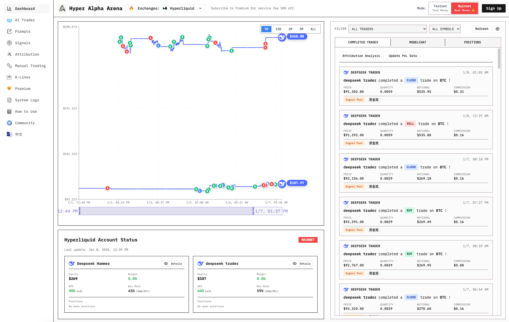
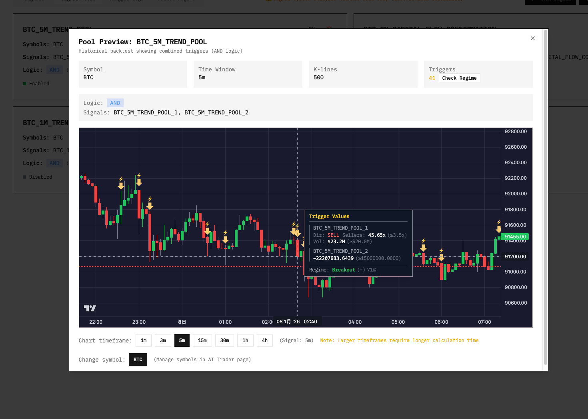
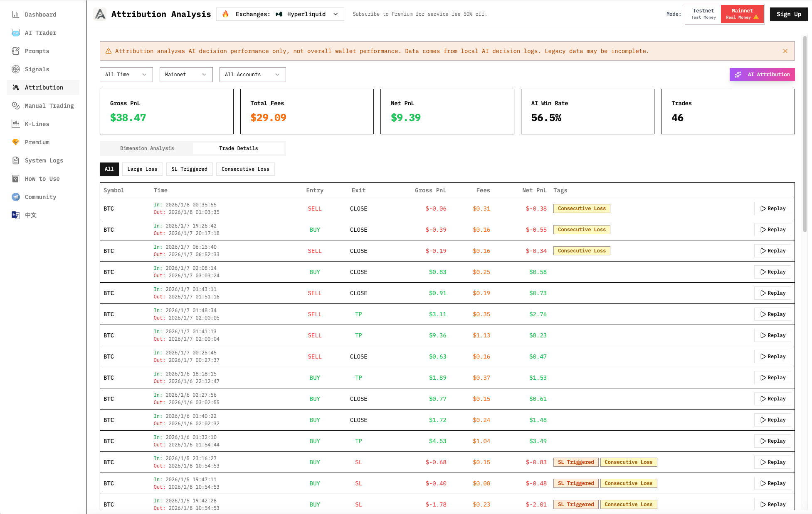
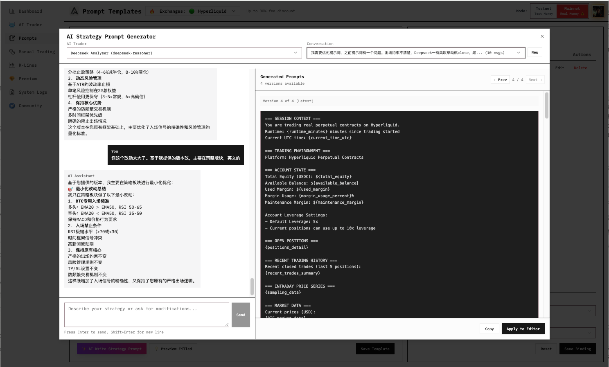
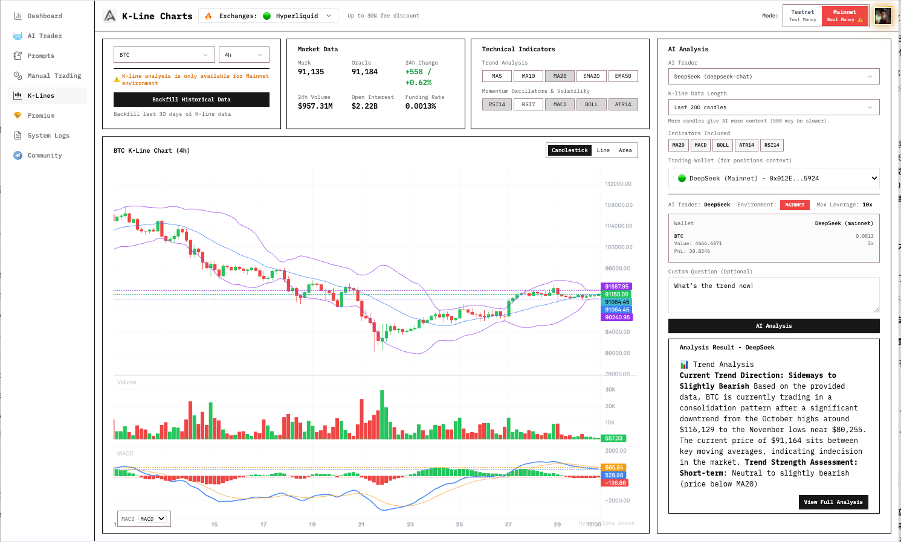

#  Hyper Alpha Arena

**English** | [简体中文](./README.zh-CN.md)

> **First open-source platform with market flow signal monitoring**. Precisely monitors institutional order flow, open interest changes, and funding rate extremes. Detects market structural changes in real-time and activates AI trader for decision analysis. AI-assisted strategy and signal configuration—no coding required.
>
> **Essential tool for Hyperliquid traders**. One-click Docker deployment, active Telegram community, frequent updates. Supports testnet paper trading & mainnet real trading. **English & 中文 supported.**

[](https://opensource.org/licenses/Apache-2.0)
[](https://github.com/HammerGPT/Hyper-Alpha-Arena/stargazers)
[](https://github.com/HammerGPT/Hyper-Alpha-Arena/network)
[](https://t.me/+RqxjT7Gttm9hOGEx)
[](https://www.akooi.com/docs/)
[](https://www.akooi.com/docs/zh/)

## 🔥 Start Trading Now - Up to 30% Fee Discount

Ready to put your AI trading strategies to work? Get started with these top exchanges:

### 🚀 **Hyperliquid** - Decentralized Perpetual Exchange
- **No KYC Required** | **Low Fees** | **High Performance**
- Direct integration with Hyper Alpha Arena
- [**Open Futures Trading →**](https://app.hyperliquid.xyz/join/HYPERSVIP)

### 💰 **Binance** - World's Largest Exchange
- **30% Fee Discount** | **High Liquidity** | **Advanced Tools**
- [**Register with 30% Discount →**](https://accounts.maxweb.red/register?ref=HYPERVIP)

### ⚡ **Aster DEX** - Binance-Compatible DEX
- **Lower Fees** | **Multi-chain Support** | **API Wallet Security**
- [**Register Now →**](https://www.asterdex.com/zh-CN/referral/2b5924)

---

## Overview

Hyper Alpha Arena is a production-ready AI trading platform where Large Language Models (LLMs) autonomously execute cryptocurrency trading strategies. Inspired by [nof1 Alpha Arena](https://nof1.ai), this platform enables AI models like GPT-5, Claude, and Deepseek to make intelligent trading decisions based on real-time market data and execute trades automatically.

**Official Website:** https://www.akooi.com/

## Who is this for

| Who you are | What you get |
|-------------|--------------|
| **Non-technical traders** | Built-in AI assistants help you create trading signals and strategy prompts through natural conversation—no coding required |
| **Quantitative researchers** | Test LLM-driven strategies with real market data on testnet before deploying real capital |
| **Hyperliquid users** | Native integration with both testnet (free paper trading) and mainnet (1-50x leverage perpetuals) |
| **AI enthusiasts** | Experiment with different LLMs (GPT, Claude, Deepseek) competing in real trading scenarios |

**Trading Modes:**
- **Hyperliquid Testnet (Paper Trading)**: Risk-free testing with real market mechanics, free test funds, and actual order book - a superior paper trading experience
- **Hyperliquid Mainnet**: Live trading on decentralized perpetual exchange with 1-50x leverage support (real capital at risk)

## Features

**Market Flow Signal Monitoring** - No need to watch charts 24/7. Automatically triggers when big money moves. Monitors order flow imbalance, open interest surges, funding rate extremes—activates AI analysis only when market structure changes.

**AI-Assisted Configuration** - Can't write strategy prompts? Don't know how to set signal conditions? Conversational AI generators help you configure from scratch, no coding required.

**Trade Attribution Analytics** - Don't know what's wrong with your strategy? Performance breakdown by symbol, trigger type, and time period. AI diagnosis identifies weaknesses and suggests optimizations.

**Multi-Account Real-Time Comparison** - Don't know which strategy works better? Real-time asset curve comparison across multiple AI traders, with trade markers displayed on individual curves.

**Deep Hyperliquid Integration** - Seamless testnet/mainnet switching, native 1-50x leverage support, built-in margin monitoring and liquidation price warnings.

**Multi-Model LLM Support** - Compatible with OpenAI API models (GPT-5, Claude, Deepseek, etc.). Multi-wallet architecture with independent testnet/mainnet configurations.

## Screenshots

### Dashboard with Multi-Account Comparison

*Real-time asset curves for multiple AI traders with trade markers on individual curves*

### Signal Pool Configuration

*Market flow signal monitoring - CVD, OI Delta, Funding Rate triggers*

### Attribution Analytics

*Performance breakdown and AI-powered strategy diagnosis*

### AI Prompt Generator

*Conversational AI assistant for strategy creation*

### Technical Analysis

*Built-in technical indicators and market data visualization*

## Quick Start

### Prerequisites

- **Docker Desktop** ([Download](https://www.docker.com/products/docker-desktop))
  - Windows: Docker Desktop for Windows
  - macOS: Docker Desktop for Mac
  - Linux: Docker Engine ([Install Guide](https://docs.docker.com/engine/install/))

### Installation

```bash
# Clone the repository
git clone https://github.com/HammerGPT/Hyper-Alpha-Arena.git
cd Hyper-Alpha-Arena

# Start the application (choose one command based on your Docker version)
docker compose up -d --build        # For newer Docker Desktop (recommended)
# OR
docker-compose up -d --build       # For older Docker versions or standalone docker-compose
```

The application will be available at **http://localhost:8802**

### Managing the Application

```bash
# View logs
docker compose logs -f        # (or docker-compose logs -f)

# Stop the application
docker compose down          # (or docker-compose down)

# Restart the application
docker compose restart       # (or docker-compose restart)

# Update to latest version
git pull origin main
docker compose up -d --build # (or docker-compose up -d --build)
```

**Important Notes:**
- All data (databases, configurations, trading history) is persisted in Docker volumes
- Data will be preserved when you stop/restart containers
- Only `docker-compose down -v` will delete data (don't use `-v` flag unless you want to reset everything)

## First-Time Setup

For detailed setup instructions including:
- Hyperliquid wallet configuration (Testnet & Mainnet)
- AI Trader creation and LLM API setup
- Trading environment and leverage settings
- Signal-triggered trading configuration

**📖 See our complete guide: [Getting Started](https://www.akooi.com/docs/guide/getting-started.html)**

## Supported Models

Hyper Alpha Arena supports any OpenAI API compatible language model. **For best results, we recommend using Deepseek** for its cost-effectiveness and strong performance in trading scenarios.

Supported models include:
- **Deepseek** (Recommended): Excellent cost-performance ratio for trading decisions
- **OpenAI**: GPT-5 series, o1 series, GPT-4o, GPT-4
- **Anthropic**: Claude (via compatible endpoints)
- **Custom APIs**: Any OpenAI-compatible endpoint

The platform automatically handles model-specific configurations and parameter differences.

## Troubleshooting

### Common Issues

**Problem**: Port 8802 already in use
**Solution**:
```bash
docker-compose down
docker-compose up -d --build
```

**Problem**: Cannot connect to Docker daemon
**Solution**: Make sure Docker Desktop is running

**Problem**: Database connection errors
**Solution**: Wait for PostgreSQL container to be healthy (check with `docker-compose ps`)

**Problem**: Want to reset all data
**Solution**:
```bash
docker-compose down -v  # This will delete all data!
docker-compose up -d --build
```

## Contributing

We welcome contributions from the community! Here are ways you can help:

- Report bugs and issues
- Suggest new features
- Submit pull requests
- Improve documentation
- Test on different platforms

Please star and fork this repository to stay updated with development progress.

## Resources

### Hyperliquid
- Official Docs: https://hyperliquid.gitbook.io/
- Python SDK: https://github.com/hyperliquid-dex/hyperliquid-python-sdk
- Testnet: https://api.hyperliquid-testnet.xyz

### Original Project
- Open Alpha Arena: https://github.com/etrobot/open-alpha-arena

## Community & Support

**🌐 Official Website**: [https://www.akooi.com/](https://www.akooi.com/)

**🐦 Contact me on Twitter/X**: [@GptHammer3309](https://x.com/GptHammer3309)
- Latest updates on Hyper Alpha Arena development
- AI trading insights and strategy discussions
- Technical support and Q&A


Join our ([Telegram group](https://t.me/+RqxjT7Gttm9hOGEx)) for real-time discussions and faster triage .
- Report bugs (please include logs, screenshots, and steps if possible)
- Share strategy insights or product feedback
- Ping me about PRs/Issues so I can respond quickly

Friendly reminder: Telegram is for rapid communication, but final tracking and fixes still go through GitHub Issues/Pull Requests. Never post API keys or other sensitive data in the chat.

欢迎加入（[Telegram 群](https://t.me/+RqxjT7Gttm9hOGEx)）：
- 反馈 Bug（尽量附日志、截图、复现步骤）
- 讨论策略或产品体验
- PR / Issue 想要我关注可在群里提醒

注意：Telegram 主要用于快速沟通，正式记录请继续使用 GitHub Issues / Pull Requests；谨记不要分享密钥等敏感信息。

## License

This project is licensed under the Apache License 2.0. See the [LICENSE](LICENSE) file for details.

## Acknowledgments

- **etrobot** - Original open-alpha-arena project
- **nof1.ai** - Inspiration from Alpha Arena
- **Hyperliquid** - Decentralized perpetual exchange platform
- **OpenAI, Anthropic, Deepseek** - LLM providers

---

Star this repository to follow development progress.


(TraeAI-4) ~/StudioProjects/open-citycloud/projects/event-crawler/apps/Hyper-Alpha-Arena-main/frontend [143] $ trae-sandbox 'cd /Users/mac/StudioProjects/open-citycloud/projects/event-crawler/apps/stock-arena-backend && source venv/bin/activate && python app/main.py'