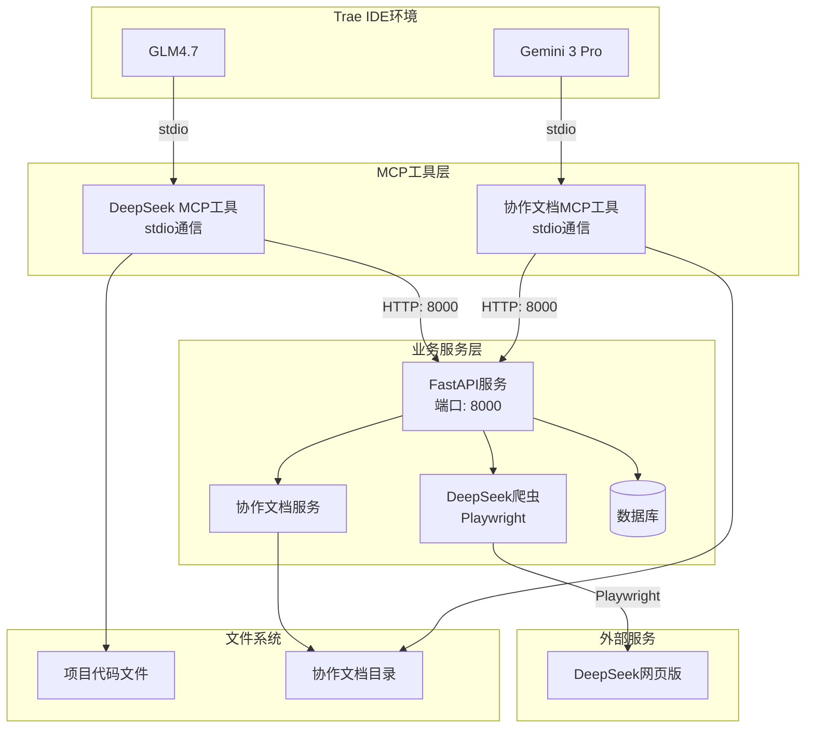
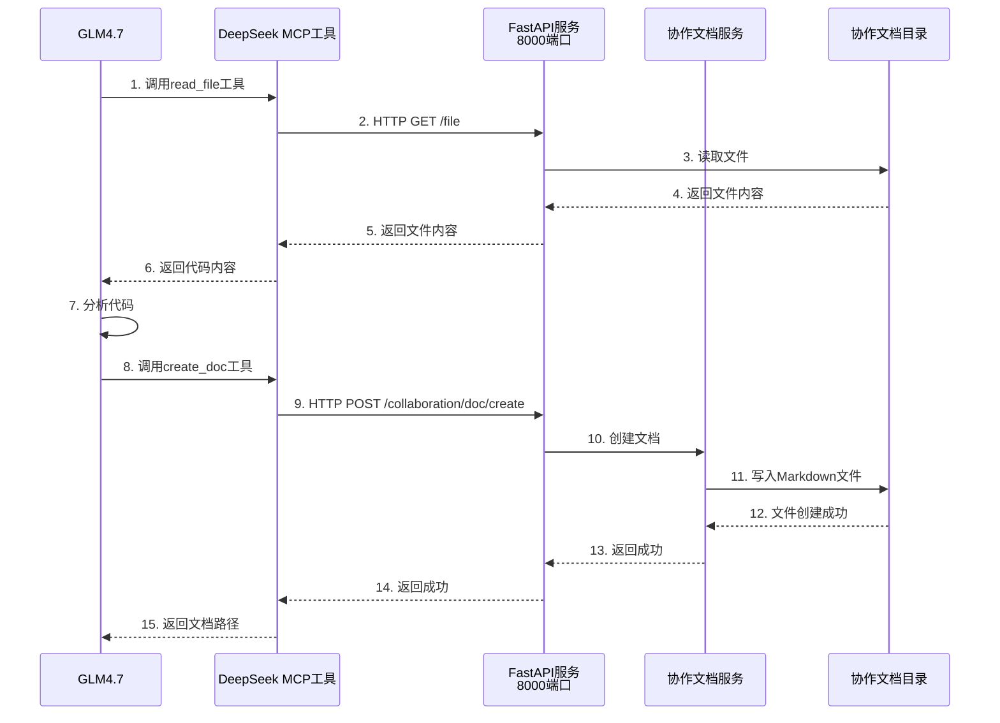
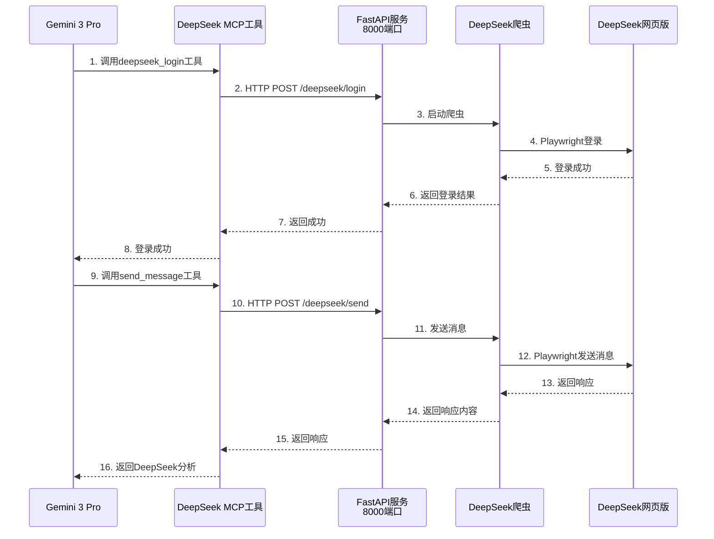
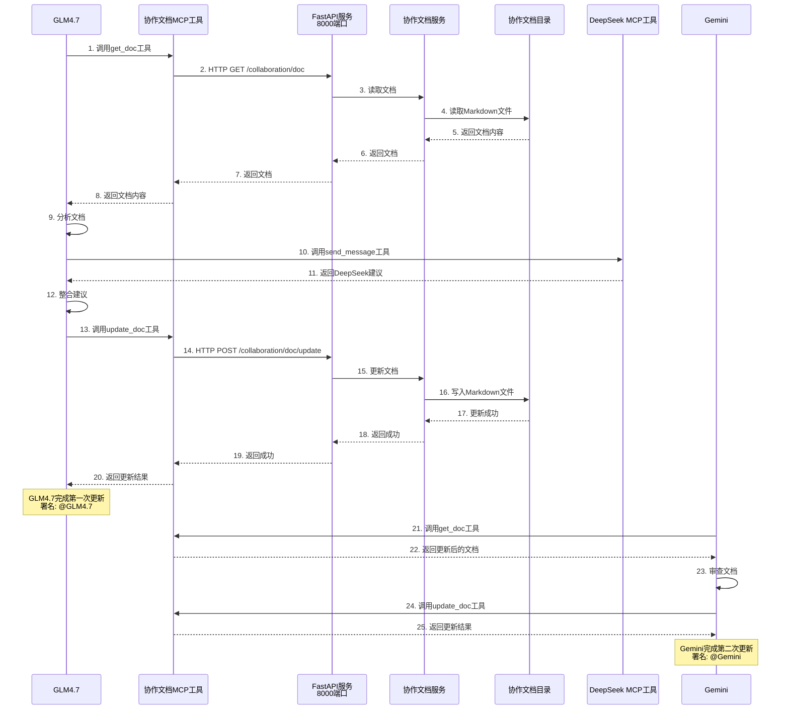

# MCP系统架构流程图

## 系统概述

DeepSeek + Trae AI模型协作系统采用分层架构，各组件通过不同的通信协议进行交互。

## 整体架构图



## 组件说明

### 1. Trae IDE环境
**组件**: GLM4.7、Gemini 3 Pro
**职责**:
- 作为AI助手运行在Trae IDE中
- 通过MCP协议调用工具
- 读取项目代码和文档
- 生成协作文档

**通信方式**: stdio（标准输入输出）

### 2. MCP工具层
**组件**: 
- DeepSeek MCP工具（TypeScript）
- 协作文档MCP工具（TypeScript）

**职责**:
- 实现MCP协议
- 提供工具定义
- 处理Trae IDE的调用请求
- 转换为HTTP请求调用业务服务

**通信方式**: 
- 与Trae IDE: stdio
- 与业务服务: HTTP（8000端口）

### 3. 业务服务层
**组件**: 
- FastAPI服务（端口8000）
- DeepSeek爬虫（Playwright）
- 协作文档服务
- 数据库

**职责**:
- 提供HTTP API接口
- 处理DeepSeek爬虫请求
- 管理协作文档
- 存储协作日志和版本

**通信方式**: HTTP（8000端口）

### 4. 外部服务
**组件**: DeepSeek网页版
**职责**:
- 提供AI对话服务
- 响应爬虫的请求

**通信方式**: HTTPS

### 5. 文件系统
**组件**: 
- 项目代码文件
- 协作文档目录

**职责**:
- 存储项目源代码
- 存储协作文档
- 支持版本管理

## 数据流向

### 场景1: GLM4.7读取代码并创建文档



### 场景2: Gemini调用DeepSeek获取分析



### 场景3: GLM4.7和Gemini协作更新文档



## 端口说明

### 8000端口 - 业务服务端口
**用途**: FastAPI服务监听端口
**通信协议**: HTTP
**服务对象**: MCP工具层
**功能**:
- 提供DeepSeek爬虫API
- 提供协作文档管理API
- 提供协作日志查询API

**示例请求**:
```bash
# DeepSeek登录
POST http://localhost:8000/mcp/deepseek/login

# 创建协作文档
POST http://localhost:8000/mcp/collaboration/doc/create

# 更新协作文档
POST http://localhost:8000/mcp/collaboration/doc/update
```

### stdio通信 - MCP协议
**用途**: Trae IDE与MCP工具之间的通信
**通信协议**: stdio（标准输入输出）
**服务对象**: Trae IDE
**功能**:
- 工具调用
- 结果返回
- 错误处理

**特点**:
- 不需要网络端口
- 通过标准输入输出通信
- 支持流式传输

## MCP工具能力

### DeepSeek MCP工具能力
1. **deepseek_login** - 登录DeepSeek
2. **send_message_to_deepseek** - 发送消息给DeepSeek
3. **start_deepseek_session** - 开始新会话
4. **get_deepseek_conversations** - 获取对话历史

### 协作文档MCP工具能力
1. **create_collaboration_doc** - 创建协作文档
2. **update_collaboration_doc** - 更新协作文档
3. **get_collaboration_doc** - 获取协作文档
4. **list_collaboration_docs** - 列出协作文档

## 部署架构

### 开发环境
```
Trae IDE (本地)
    ↓ stdio
MCP工具 (本地进程)
    ↓ HTTP: 8000
FastAPI服务 (本地进程)
    ↓ Playwright
DeepSeek网页版 (远程)
    ↓
协作文档 (本地文件系统)
```

### 生产环境
```
Trae IDE (本地)
    ↓ stdio
MCP工具 (本地进程)
    ↓ HTTP: 8000
FastAPI服务 (Docker容器)
    ↓ Playwright
DeepSeek网页版 (远程)
    ↓
协作文档 (持久化存储)
```

## 安全考虑

### 1. API安全
- 使用API密钥保护8000端口
- 限制允许的模型列表
- 实施请求限流

### 2. 数据安全
- 敏感信息不存储在文档中
- 使用环境变量管理凭证
- 定期备份协作文档

### 3. 通信安全
- MCP工具与Trae IDE: 本地stdio通信
- MCP工具与业务服务: 本地HTTP通信
- DeepSeek爬虫: HTTPS加密通信

## 性能优化

### 1. 缓存策略
- 协作文档缓存
- DeepSeek响应缓存
- 代码文件缓存

### 2. 异步处理
- FastAPI异步请求处理
- DeepSeek爬虫异步操作
- 数据库异步查询

### 3. 负载均衡
- 多个MCP工具实例
- 数据库连接池
- 请求队列管理

---

*架构流程图最后更新: 2026-01-14*