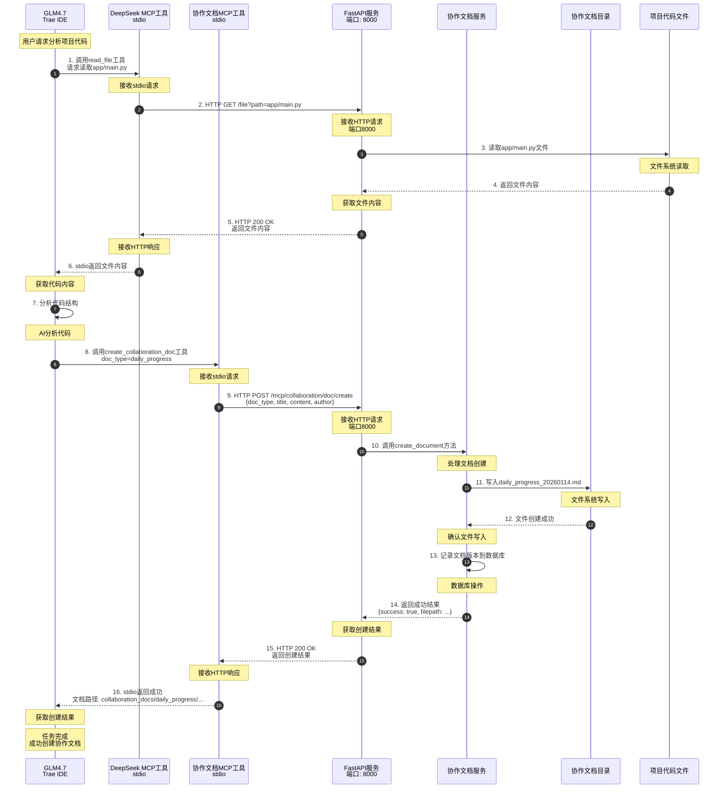
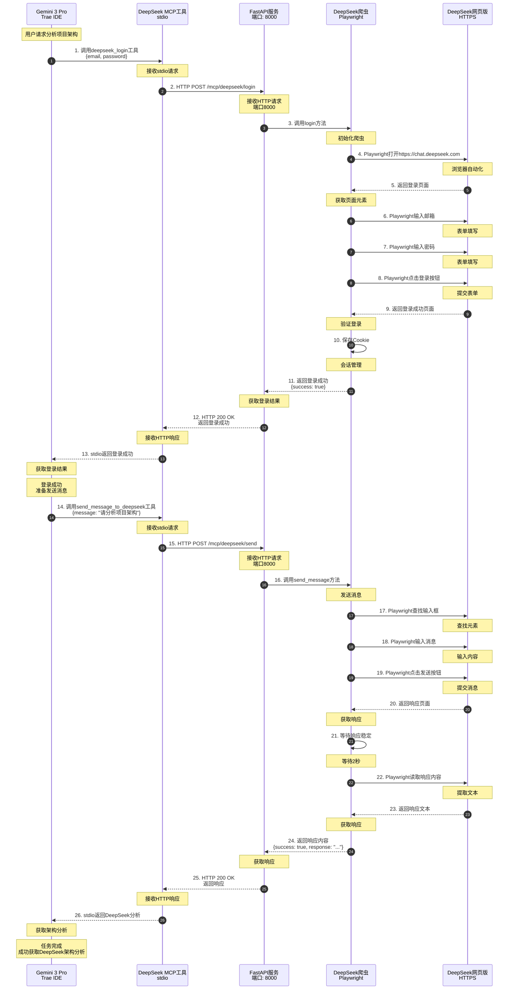
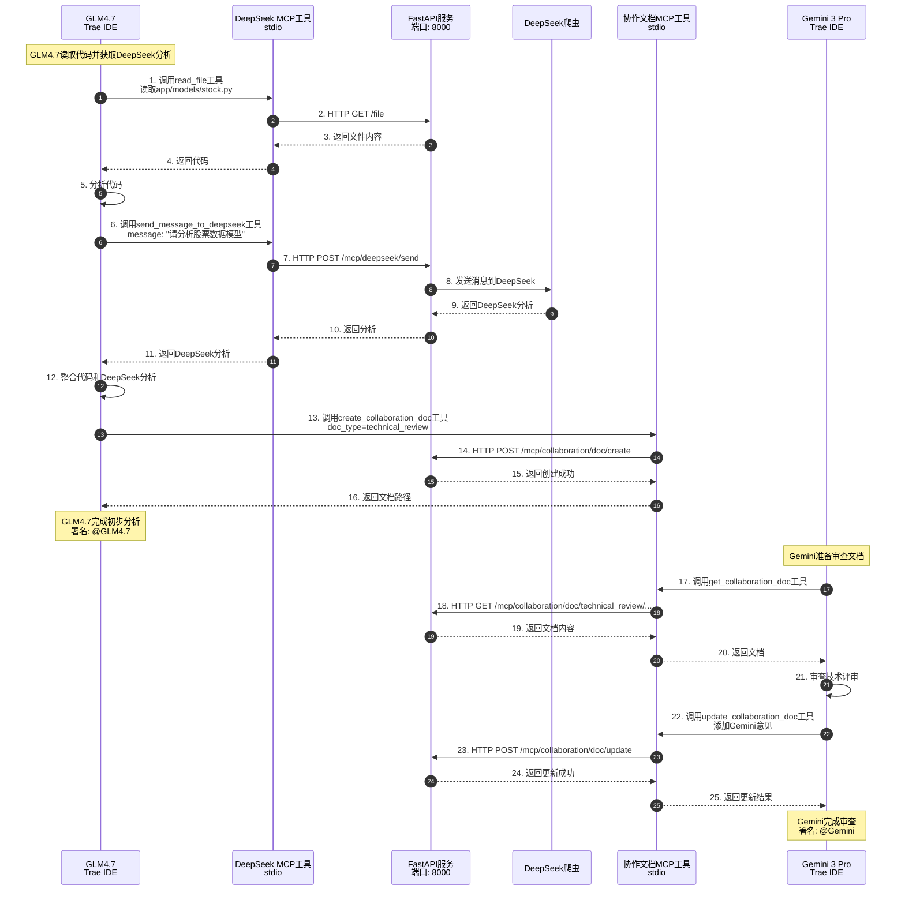

```mermaid
sequenceDiagram
    autonumber
    participant GLM47 as GLM4.7<br/>Trae IDE
    participant CollabMCP as 协作文档MCP工具<br/>stdio
    participant FastAPI as FastAPI服务<br/>端口: 8000
    participant CollabService as 协作文档服务
    participant CollabDocs as 协作文档目录
    participant Gemini as Gemini 3 Pro<br/>Trae IDE
    
    Note over GLM47: GLM4.7第一次更新文档
    
    GLM47->>CollabMCP: 1. 调用get_collaboration_doc工具<br/>doc_path=daily_progress/...
    Note over CollabMCP: 接收stdio请求
    
    CollabMCP->>FastAPI: 2. HTTP GET /mcp/collaboration/doc/daily_progress/...
    Note over FastAPI: 接收HTTP请求<br/>端口8000
    
    FastAPI->>CollabService: 3. 调用get_document方法
    Note over CollabService: 读取文档
    
    CollabService->>CollabDocs: 4. 读取daily_progress_20260114.md
    Note over CollabDocs: 文件系统读取
    
    CollabDocs-->>CollabService: 5. 返回文件内容
    Note over CollabService: 获取文档内容
    
    CollabService-->>FastAPI: 6. 返回文档内容<br/>{success: true, content: "..."}
    Note over FastAPI: 获取文档
    
    FastAPI-->>CollabMCP: 7. HTTP 200 OK<br/>返回文档内容
    Note over CollabMCP: 接收HTTP响应
    
    CollabMCP-->>GLM47: 8. stdio返回文档内容
    Note over GLM47: 获取文档
    
    GLM47->>GLM47: 9. 分析文档并准备更新
    Note over GLM47: AI分析文档
    
    GLM47->>CollabMCP: 10. 调用update_collaboration_doc工具<br/>{doc_path, content, signature}
    Note over CollabMCP: 接收stdio请求<br/>signature: "[2026-01-14 10:30] @GLM4.7: 添加架构分析"
    
    CollabMCP->>FastAPI: 11. HTTP POST /mcp/collaboration/doc/update
    Note over FastAPI: 接收HTTP请求<br/>端口8000
    
    FastAPI->>CollabService: 12. 调用update_document方法
    Note over CollabService: 更新文档
    
    CollabService->>CollabDocs: 13. 备份原文件<br/>daily_progress_20260114.md.123456.bak
    Note over CollabDocs: 文件系统备份
    
    CollabDocs-->>CollabService: 14. 备份成功
    Note over CollabService: 确认备份
    
    CollabService->>CollabDocs: 15. 写入新内容<br/>daily_progress_20260114.md
    Note over CollabDocs: 文件系统写入
    
    CollabDocs-->>CollabService: 16. 写入成功
    Note over CollabService: 确认写入
    
    CollabService->>CollabService: 17. 记录新版本到数据库
    Note over CollabService: 数据库操作
    
    CollabService-->>FastAPI: 18. 返回成功<br/>{success: true, backup: ...}
    Note over FastAPI: 获取更新结果
    
    FastAPI-->>CollabMCP: 19. HTTP 200 OK<br/>返回更新结果
    Note over CollabMCP: 接收HTTP响应
    
    CollabMCP-->>GLM47: 20. stdio返回成功
    Note over GLM47: 获取更新结果
    
    Note over GLM47: GLM4.7完成第一次更新<br/>署名: @GLM4.7
    
    Note over Gemini: Gemini准备第二次更新
    
    Gemini->>CollabMCP: 21. 调用get_collaboration_doc工具<br/>doc_path=daily_progress/...
    Note over CollabMCP: 接收stdio请求
    
    CollabMCP->>FastAPI: 22. HTTP GET /mcp/collaboration/doc/daily_progress/...
    Note over FastAPI: 接收HTTP请求<br/>端口8000
    
    FastAPI->>CollabService: 23. 调用get_document方法
    Note over CollabService: 读取文档
    
    CollabService->>CollabDocs: 24. 读取daily_progress_20260114.md
    Note over CollabDocs: 文件系统读取
    
    CollabDocs-->>CollabService: 25. 返回更新后的文件内容
    Note over CollabService: 获取更新后的文档
    
    CollabService-->>FastAPI: 26. 返回文档内容
    Note over FastAPI: 获取文档
    
    FastAPI-->>CollabMCP: 27. HTTP 200 OK<br/>返回文档内容
    Note over CollabMCP: 接收HTTP响应
    
    CollabMCP-->>Gemini: 28. stdio返回更新后的文档
    Note over Gemini: 获取更新后的文档
    
    Gemini->>Gemini: 29. 审查文档内容
    Note over Gemini: AI审查文档
    
    Gemini->>CollabMCP: 30. 调用update_collaboration_doc工具<br/>{doc_path, content, signature}
    Note over CollabMCP: 接收stdio请求<br/>signature: "[2026-01-14 11:00] @Gemini: 审查并完善内容"
    
    CollabMCP->>FastAPI: 31. HTTP POST /mcp/collaboration/doc/update
    Note over FastAPI: 接收HTTP请求<br/>端口8000
    
    FastAPI->>CollabService: 32. 调用update_document方法
    Note over CollabService: 更新文档
    
    CollabService->>CollabDocs: 33. 备份原文件
    Note over CollabDocs: 文件系统备份
    
    CollabDocs-->>CollabService: 34. 备份成功
    Note over CollabService: 确认备份
    
    CollabService->>CollabDocs: 35. 写入新内容
    Note over CollabDocs: 文件系统写入
    
    CollabDocs-->>CollabService: 36. 写入成功
    Note over CollabService: 确认写入
    
    CollabService->>CollabService: 37. 记录新版本到数据库
    Note over CollabService: 数据库操作
    
    CollabService-->>FastAPI: 38. 返回成功
    Note over FastAPI: 获取更新结果
    
    FastAPI-->>CollabMCP: 39. HTTP 200 OK<br/>返回更新结果
    Note over CollabMCP: 接收HTTP响应
    
    CollabMCP-->>Gemini: 40. stdio返回成功
    Note over Gemini: 获取更新结果
    
    Note over Gemini: Gemini完成第二次更新<br/>署名: @Gemini
```

# MCP系统时序图

## 概述

本文档详细说明DeepSeek + Trae AI模型协作系统中各组件之间的交互时序。

## 场景一：GLM4.7读取项目代码并创建协作文档

### 时序图

### 关键步骤说明

1. **读取代码** (步骤1-6)
   - GLM4.7通过MCP工具读取项目文件
   - MCP工具通过HTTP调用FastAPI服务
   - FastAPI从文件系统读取文件
   - 结果通过stdio返回给GLM4.7

2. **分析代码** (步骤7)
   - GLM4.7分析代码内容
   - 准备创建协作文档

3. **创建文档** (步骤8-16)
   - GLM4.7通过MCP工具创建文档
   - MCP工具通过HTTP调用FastAPI服务
   - FastAPI调用协作文档服务
   - 服务写入Markdown文件到文件系统
   - 服务记录文档版本到数据库
   - 结果通过stdio返回给GLM4.7

---

## 场景二：Gemini调用DeepSeek获取架构分析

### 时序图

### 关键步骤说明

1. **登录DeepSeek** (步骤1-13)
   - Gemini通过MCP工具调用登录
   - MCP工具通过HTTP调用FastAPI服务
   - FastAPI调用DeepSeek爬虫
   - 爬虫使用Playwright自动化登录
   - 登录成功后保存Cookie
   - 结果通过stdio返回给Gemini

2. **发送消息** (步骤14-26)
   - Gemini通过MCP工具发送消息
   - MCP工具通过HTTP调用FastAPI服务
   - FastAPI调用DeepSeek爬虫
   - 爬虫使用Playwright发送消息
   - 爬虫等待DeepSeek响应
   - 爬虫读取响应内容
   - 结果通过stdio返回给Gemini

---

## 场景三：GLM4.7和Gemini协作更新文档

### 时序图

### 关键步骤说明

1. **GLM4.7第一次更新** (步骤1-20)
   - GLM4.7通过MCP工具获取文档
   - MCP工具通过HTTP调用FastAPI服务
   - FastAPI从文件系统读取文档
   - GLM4.7分析文档并准备更新
   - GLM4.7通过MCP工具更新文档
   - 服务自动备份原文件
   - 服务写入新内容
   - 服务记录新版本到数据库
   - 结果通过stdio返回给GLM4.7

2. **Gemini第二次更新** (步骤21-40)
   - Gemini通过MCP工具获取更新后的文档
   - MCP工具通过HTTP调用FastAPI服务
   - FastAPI从文件系统读取文档
   - Gemini审查文档内容
   - Gemini通过MCP工具更新文档
   - 服务自动备份原文件
   - 服务写入新内容
   - 服务记录新版本到数据库
   - 结果通过stdio返回给Gemini

---

## 场景四：完整协作流程（GLM4.7 → DeepSeek → Gemini → 文档）

### 时序图

### 关键步骤说明

1. **GLM4.7分析阶段** (步骤1-12)
   - GLM4.7读取项目代码
   - GLM4.7调用DeepSeek获取分析
   - GLM4.7整合代码和DeepSeek分析
   - GLM4.7创建技术评审文档

2. **Gemini审查阶段** (步骤17-25)
   - Gemini读取技术评审文档
   - Gemini审查文档内容
   - Gemini更新文档，添加自己的意见
   - 文档包含GLM4.7和Gemini的署名

---

## 通信协议对比

### stdio通信（Trae IDE ↔ MCP工具）
**特点**:
- 本地进程间通信
- 无需网络端口
- 标准输入输出流
- 支持流式传输

**优势**:
- 低延迟
- 无网络开销
- 安全性高
- 简单可靠

**使用场景**:
- Trae IDE调用MCP工具
- 工具调用结果返回
- 错误信息传递

### HTTP通信（MCP工具 ↔ 业务服务）
**特点**:
- 基于HTTP协议
- 使用8000端口
- RESTful API设计
- JSON数据格式

**优势**:
- 标准化协议
- 易于调试
- 支持跨语言
- 可扩展性强

**使用场景**:
- MCP工具调用业务服务
- 文件读写操作
- DeepSeek爬虫请求
- 数据库查询

### Playwright通信（业务服务 ↔ DeepSeek网页版）
**特点**:
- 浏览器自动化
- 模拟用户操作
- 支持JavaScript执行
- Cookie管理

**优势**:
- 真实浏览器环境
- 支持复杂交互
- 可处理动态内容
- 稳定可靠

**使用场景**:
- DeepSeek登录
- 消息发送
- 响应读取
- 会话管理

## 性能指标

### 响应时间
- **stdio调用**: < 10ms
- **HTTP调用**: < 50ms
- **DeepSeek响应**: 2-10s（取决于消息复杂度）
- **文件读写**: < 100ms
- **数据库操作**: < 50ms

### 并发能力
- **stdio并发**: 支持（每个MCP工具独立进程）
- **HTTP并发**: 支持（FastAPI异步处理）
- **DeepSeek并发**: 限制（避免被封锁）

---

*时序图最后更新: 2026-01-14*