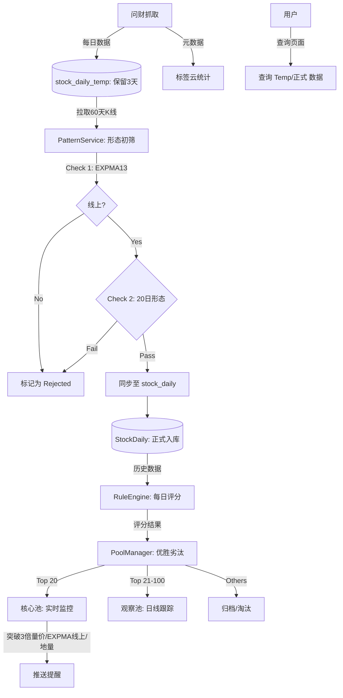

# 《缠论量价》分析与动态股票池系统技术方案

## 1. 概述
本方案旨在优化现有的股票监控系统，解决股票池膨胀（900+只）导致的计算和监控瓶颈。系统将引入**“漏斗式筛选”**机制和**“分级股票池管理”**策略，结合《缠论量价》形态分析，实现“每日精选、优胜劣汰”，最终聚焦于 10-20 只核心股票进行实时监控和尾盘操作。

## 2. 核心业务目标
1.  **精简目标**：从每日抓取的几十只候选股中，通过形态和评分筛选，只保留高质量标的。
2.  **总量控制**：
    *   **核心池 (Core Pool)**：约 20 只，开启秒级/分钟级实时监控（同花顺推送），用于当日尾盘操作。
    *   **观察池 (Watch Pool)**：约 80 只，每日收盘后计算日线评分，作为核心池的后备。
    *   **总容量限制**：整个系统重点关注股票不超过 100 只，超出部分强制淘汰。
3.  **形态驱动**：基于缠论（底分型、包含关系）和量价（三倍量、地量）进行叠加评分，作为筛选和淘汰的唯一标准。
4.  **行业/概念热点**：统计近3天问财数据中的行业和概念分布，生成标签云，辅助判断资金流向。

## 3. 总体架构与流程

### 3.1 漏斗筛选模型
```mermaid
graph TD
    A[数据源: 问财三倍量抓取] -->|每日新增 30-50 只| B(临时数据表 stock_daily_temp)
    B -->|保留3天可配| C[形态初筛 (内存计算)]
    C -->|检查EXPMA13 & 20日形态| D{符合准入条件?}
    D -->|No| E[记录原因并保留在Temp表]
    D -->|Yes| F[入库 stock_daily & 纳入观察池]
    F --> G[存量股票池 900+]
    G -->|每日评分重算| H(优胜劣汰排序)
    H -->|Top 20| I[核心池 (实时监控)]
    H -->|Top 21-100| J[观察池 (日线跟踪)]
    H -->|Rank > 100| K[淘汰/归档]
    
    L[近3天问财数据] -->|统计聚合| M[行业/概念标签云]
```

### 3.2 详细业务流程

#### 3.2.1 第一步：精准抓取 (Source)
保持现有的问财抓取逻辑，但增加更严格的前置条件（用户已指定）：
- **核心条件**：`{T}日成交量 >= {T-1}日成交量 * 2.5` (三倍量/倍量)
- **排除条件**：`非北交`, `非创业板`, `非科创板`, `非ST`
- **形态限制**：`{T-1}日和{T}日涨幅 < 13%`, `收盘价 < 25`
- **行业/概念**：`概念`, `行业` (需非冷门)

#### 3.2.2 第二步：形态初筛 (Filter) - **临时数据缓冲层**
新抓取的股票先存入 **`stock_daily_temp`** 表，保留 **3天**（可配置），不直接污染主表。
1.  **数据拉取**：从 CSV 或 接口拉取过去 60 天的日线数据，存入 Temp 表。
2.  **准入计算**：
    - **EXPMA 检查**：收盘价必须在 **13日 EXPMA 线** 之上（趋势向上）。
    - **形态回溯**：检查过去 20 个交易日（可配置）的量价形态。
    - **缠论形态**：底分型、阳包阴等。
3.  **结果判定**：
    - **不通过**：在 Temp 表中标记状态为 `rejected`，记录原因（如“破位”、“EXPMA线下”），数据保留 3 天后清理。
    - **通过**：将数据正式同步到 `stock_daily`，并纳入 `stock_pool`。

#### 3.2.3 第三步：动态池管理 (Pool Manager)
每天收盘后（或盘前），执行**优胜劣汰**任务：
1.  **全量评分**：对 现有池子 + 今日新增 股票进行全量评分。
    - 评分规则 = 量价得分 + 缠论形态得分 (叠加)。
2.  **排序截断**：
    - 按总分倒序排列。
    - **保留**：前 100 名标记为 `is_monitored=True`。
    - **淘汰**：100 名以后标记为 `is_monitored=False`，停止后续更新以节省资源。
3.  **核心晋升**：
    - 前 20 名且满足“地量后放量”特征的，标记为 `is_active=True` (实时监控)。

#### 3.2.4 第四步：实时监控与操作 (Monitor)
针对 **核心池 (Top 20)**：
- **监控频率**：实时 / 分钟级。
- **监控指标**：
    - **形态维持**：盘中是否维持形态（未被砸坏）。
    - **量价异动**：
        - 实时价格是否超过 **3倍量日的收盘价**（突破信号）。
        - 实时价格是否在 **EXPMA 13 均线**上方。
        - 是否出现 **地量** 特征（需结合时间加权预测全天成交量）。
- **推送**：满足上述任一条件时，通过同花顺 MCP / 微信推送提醒。
- **操作决策**：尾盘（14:30 - 14:50）确认形态成立后介入。

#### 3.2.5 第五步：前端可视化与查询
- **数据查询页面**：
    - 提供统一查询入口，可查询 `stock_daily` (正式池) 和 `stock_daily_temp` (临时/被拒池)。
    - 支持按 `入库时间`、`状态` (Passed/Rejected)、`拒绝原因` 筛选。
- **配置菜单**：
    - 提供图形化界面配置系统参数（如 `TEMP_DATA_RETENTION_DAYS=3`, `EXPMA_PERIOD=13` 等）。

#### 3.2.6 第六步：热点统计 (Trends)
- **数据源**：近 3 天所有从问财抓取到的原始数据（包括未入池的）。
- **统计**：聚合 `行业` 和 `概念` 字段。
- **展示**：在前端生成标签云，字体大小代表出现频次（资金活跃度）。

## 4. 详细设计

### 4.1 形态定义与配置化 (PatternAnalysisService)
配置存储于 `system_config`，支持动态热更。

**新增/优化形态规则**：

| 形态名称 | 周期 | 逻辑简述 | 分数 (可配) | 冲突处理 |
| :--- | :--- | :--- | :--- | :--- |
| **阳包阴** | 2天 | Day2实体完全包住Day1实体，且Day2为阳 | +200 | 叠加 |
| **底分型** | 3天 | 中间K线高点低点均为三根中最低 (含包含处理) | +300 | 叠加 |
| **冲高回落** | 1天 | 上影线长度 > 实体 * 2 或 > 3% | -200 (扣分) | 叠加 |
| **连阳** | 3天 | 连续3天收阳且重心上移 | +100 | 叠加 |
| **EXPMA13** | 1天 | Close > EXPMA(13) | 准入条件 | 否决项 |

*注：所有形态检测均需支持**缠论K线包含关系处理**（可配置开关 `use_chan_inclusion`）。*

### 4.2 数据库变更
1.  **`stock_daily_temp` (新增实体表)**：
    - 结构同 `stock_daily`，增加 `created_at`, `status` (pending/passed/rejected), `reject_reason`。
    - 数据保留策略：定时任务每日清理 `created_at < NOW - 3 days` 的数据。
2.  **`stock_info`**：
    - `is_active`: Top 20 标记。
    - `is_monitored`: Top 100 标记。

### 4.3 模块交互图 (优化后)


## 5. 开发计划

### Phase 1: 基础设施与抓取 (Priority High)
1.  **Playwright 自动化**：跑通问财抓取脚本，实现 Cookie 同步到后端。
2.  **Chrome 插件对接**：确保插件能触发抓取并上传数据。

### Phase 2: 形态分析服务 (PatternAnalysisService)
1.  **Temp 表机制**：创建 `stock_daily_temp` 表及清理任务。
2.  **K线预处理**：实现 `preprocess_kline` (含 EXPMA 计算、缠论包含处理)。
3.  **形态识别**：实现核心算法（底分型、阳包阴、EXPMA 判定）。
4.  **临时计算流**：实现“抓取 -> Temp存储 -> 计算 -> 入库/标记”的管道。

### Phase 3: 股票池管理与统计
1.  **优胜劣汰**：实现 `PoolManager` 的排序和状态更新逻辑。
2.  **标签云接口**：开发 `GET /api/trends/tags` 接口，返回近3天热点。

### Phase 4: 实时监控对接与前端
1.  **监控升级**：增加 3倍量突破、EXPMA13 线上、地量 的实时监控逻辑。
2.  **前端页面**：开发数据查询页面（含 Temp 数据）和配置菜单。
