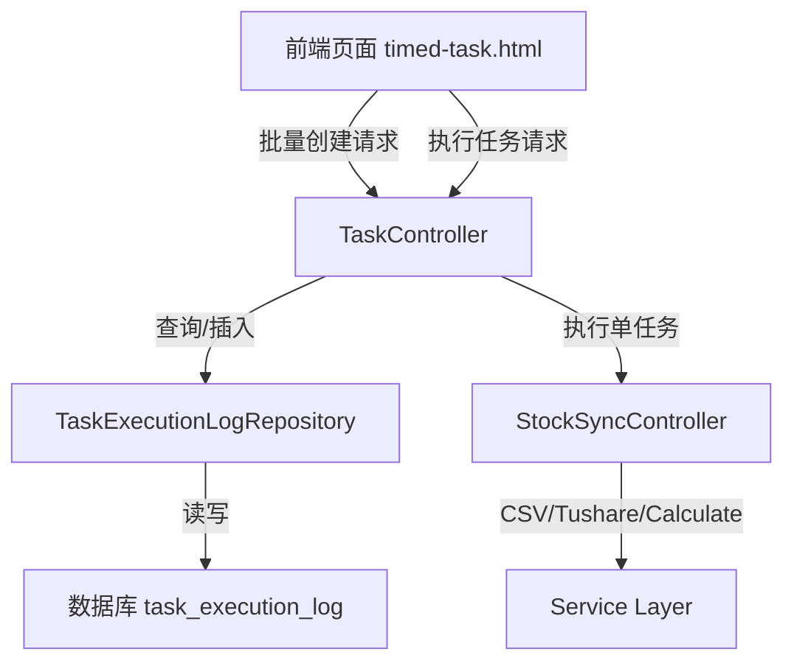

# DESIGN_批量定时任务系统.md

## 1. 系统架构

### 1.1 模块图

### 1.2 核心流程
1. **批量创建**: 用户点击按钮 -> 后端查询所有 `StockInfo` -> 为每个股票创建一条 `TaskExecutionLog` 记录 (Status: pending)。
2. **任务执行**: 用户在列表选择任务 -> 点击执行 -> 后端接收任务ID列表 -> 异步遍历任务 -> 请求对应的 `task_url` -> 更新任务状态 (running -> success/failed)。

## 2. 数据库设计

### 2.1 表结构: `task_execution_log`
| 字段名 | 类型 | 说明 |
|Data Type|Description|
|---|---|---|
| id | Integer | 主键 |
| task_type | String(50) | 任务类型: csv_sync, tushare_sync, calculate |
| stock_code | String(20) | 股票代码 |
| task_url | String(500) | 执行URL |
| status | String(20) | 状态: pending, running, success, failed |
| result_message | Text | 执行结果信息 |
| created_at | DateTime | 创建时间 |
| executed_at | DateTime | 执行完成时间 |

## 3. 接口设计

### 3.1 单任务执行接口 (Atomic)
- `GET /api/v1/stock/sync/csv/{code}`: 单只股票CSV同步
- `GET /api/v1/stock/sync/tushare/{code}`: 单只股票Tushare同步
- `GET /api/v1/stock/sync/calculate/{code}`: 单只股票评分计算

### 3.2 任务管理接口
- `POST /api/tasks/batch-create`: 批量创建任务
    - Body: `{ "type": "csv" | "tushare" | "calculate" }`
- `GET /api/tasks/logs`: 获取任务日志
    - Query: `page`, `page_size`, `status`, `task_type`, `stock_code`, `start_time`, `end_time`
- `POST /api/tasks/execute`: 批量执行任务
    - Body: `{ "task_ids": [1, 2, 3] }`
- `POST /api/tasks/execute-all`: 执行所有待处理任务 (可选，视前端实现而定，建议先支持选定执行)

## 4. 前端设计
- **定时任务页 (timed-task.html)**:
    - 替换原有三个大按钮的点击事件。
    - 新增 "任务管理" Tab。
    - 任务管理 Tab 包含：
        - 筛选栏 (时间, 代码, 状态)
        - 操作栏 (执行选中, 刷新列表)
        - 数据表格 (多选框, ID, 类型, 代码, URL, 状态, 结果, 时间)
        - 分页控件
