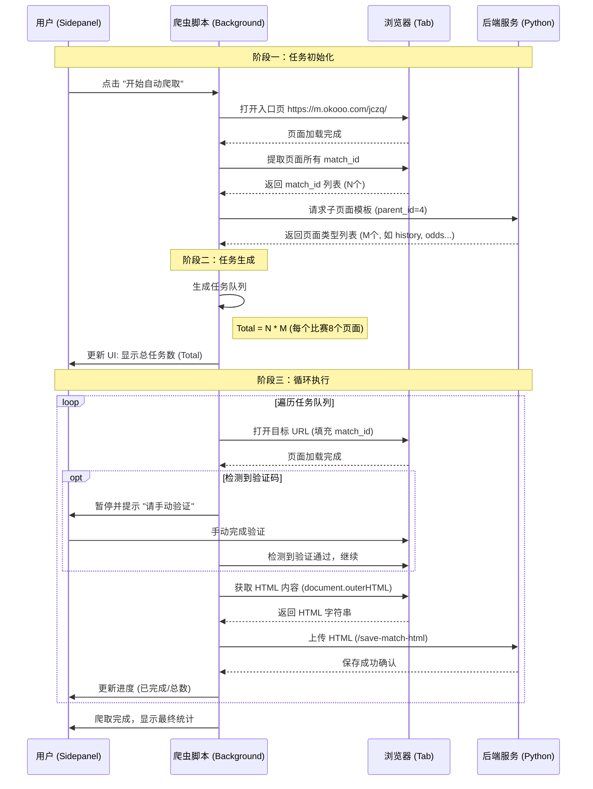

# 澳客爬虫流程优化方案

## 1. 核心流程概述

本方案旨在优化澳客网比赛数据的爬取流程，通过“预生成任务列表”的方式替代原有的“页面点击/Tab交互”方式，以提高稳定性和可控性。

### 主要变更点
1.  **任务生成前置**：不再依赖页面内的 Tab 点击跳转，而是预先根据 MatchID 和子页面类型生成所有目标 URL。
2.  **去交互化**：将复杂的“点击-等待-抓取”流程简化为“打开URL-等待-抓取”，避免因 DOM 变动导致的点击失败。
3.  **全程可视化**：在 Sidepanel 中实时展示总任务数、当前进度和成功/失败状态。

## 2. 数据流转图 (Mermaid)

## 3. 详细步骤说明

### 步骤 1: 获取比赛 ID (Match IDs)
*   **动作**: 访问 `https://m.okooo.com/jczq/`。
*   **逻辑**: 等待页面加载，使用 DOM 选择器提取所有当日比赛的 ID。
*   **输出**: `MatchID List = [1001, 1002, ...]`

### 步骤 2: 获取页面模板
*   **动作**: 调用后端 API `/api/v1/okooo/query-matches`。
*   **参数**: `sql: "select * from test_pages where parent_id = 4"`。
*   **输出**: 子页面配置列表，包含页面类型和 URL 模板（例如 `history.php?MatchID={id}`）。

### 步骤 3: 生成任务队列
*   **逻辑**: 将每个 MatchID 与所有子页面模板进行笛卡尔积组合。
*   **结果**: 一个包含所有待爬取 URL 的扁平化数组。
    *   Task 1: Match 1001 - History
    *   Task 2: Match 1001 - Odds
    *   ...
    *   Task X: Match 1002 - History
*   **UI 更新**: 在 Sidepanel 更新“总任务数”。

### 步骤 4: 执行爬取 (循环)
*   **导航**: `chrome.tabs.update(url)`。
*   **等待**: 等待页面 `readyState === 'complete'` 且关键内容元素出现。
*   **验证码处理**:
    *   检查页面是否包含“滑动验证”、“aliyun_waf”等关键词。
    *   若存在，暂停爬虫，通过 Sidepanel 或 Alert 提示用户。
    *   轮询检查直到验证码消失。
*   **数据抓取**: 使用 `chrome.scripting.executeScript` 获取 `document.documentElement.outerHTML`。
*   **数据上传**: POST 请求发送至后端 `/save-match-html`。

### 步骤 5: 结果统计
*   Sidepanel 实时显示：
    *   **比赛进度**: `当前 MatchIndex / 总 Match 数`
    *   **页面进度**: `当前 PageIndex / 总 Page 数` (或直接显示总进度)
    *   **成功/失败**: 计数器。

## 4. 异常处理与备选方案
*   **[NetworkMonitor]**: 暂时关闭初始化日志和自动 attach 功能，作为备选方案。仅在 DOM 获取失败时启用。
*   **超时重试**: 单个页面加载超过 30秒 视为超时，记录错误并跳过（或重试 1 次）。
*   **空页面**: 若获取的 HTML 内容过短（<1000字符），标记为“待验证”或“错误”。

