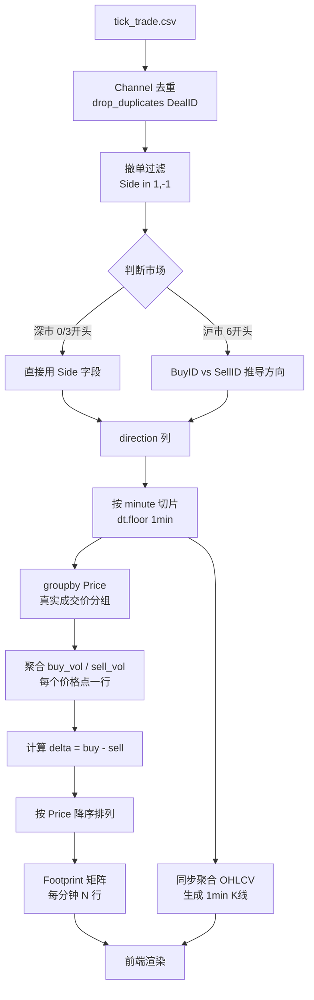

# **基于离线 Level2 CSV 的 Footprint 订单流图表 — 完整需求实现文档**

> **版本**: v2.0（基于截图目标 + 评审修正）
> **日期**: 2026-04-14
> **定位**: 盘后复盘，1 分钟 Footprint + K 线联动
> **技术栈**: Python + DuckDB + FastAPI + Vue3 + Canvas

---

## **一、目标界面定义**

以截图为准，最终界面由两个水平并排的区域组成：

```
┌─────────────────────┬────────────────────────────────┐
│   1 分钟 K 线        │   Footprint（订单流蜡烛）        │
│                     │                                │
│  ┌───┐              │  Price   Sell × Buy            │
│  │   │              │  18.82    87  × 79             │
│  │   │  ┌───┐       │  18.81   198  × 170  ← 最大量  │
│  └───┘  │   │       │  18.80    59  × 56             │
│         └───┘       │  18.79    80  × 67             │
│  Volume 柱           │  18.78    23  × 18             │
│                     │  Delta:        -87             │
└─────────────────────┴────────────────────────────────┘
```

两个区域**严格按分钟时间轴对齐**，横向可滚动历史分钟，纵轴价格共享同一坐标系。

---

## **二、数据源字段说明**

### **2.1 逐笔成交表（tick_trade.csv）— Footprint 的唯一数据源**

| 字段名 | 类型 | 含义 | 备注 |
|---|---|---|---|
| `SecuCode` | string | 股票代码 | 如 `605299.SH` |
| `TradingDay` | date | 交易日 | 格式 `YYYYMMDD` |
| `DealTime` | time | 成交时间 | 精确到毫秒，如 `09:30:01.234` |
| `DealID` | int | 成交编号 | 交易所内唯一 |
| `BuyID` | int | 买单委托号 | 用于沪市方向判断 |
| `SellID` | int | 卖单委托号 | 用于沪市方向判断 |
| `Price` | float | 成交价格 | 精度 0.01 元 |
| `Volume` | int | 成交量 | 单位：手（100股） |
| `Side` | int | 主动方向 | 深市直接用；沪市需推导（见 §3.1） |
| `Channel` | int | 交易频道 | 去重用，见 §3.2 |
| `BizIndex` | int | 交易所成交编号 | 全局唯一标识 |

---

### **2.2 逐笔委托表（tick_order.csv）— 撤单率计算用**

| 字段名 | 类型 | 含义 | 备注 |
|---|---|---|---|
| `SecuCode` | string | 股票代码 | |
| `TradingDay` | date | 委托日期 | |
| `OrderTime` | time | 委托时间 | 精确到毫秒 |
| `OrderID` | int | 委托号 | 与 Trade 表 BuyID/SellID 对应 |
| `Price` | float | 委托价格 | |
| `Volume` | int | 委托量 | |
| `OrderType` | int | 委托类型 | 沪市：0=委买, 1=委卖, -1=撤买, -11=撤卖 |
| `LastPrice` | float | 委托时最近成交价 | 可用于 fallback 方向判断 |
| `Channel` | int | 交易频道 | 去重用 |
| `BizIndex` | int | 交易所委托编号 | |
| `DBOrderID` | int | 入库 ID | 内部主键，不参与计算 |

---

### **2.3 十档快照表（snapshot.csv）— Footprint 不依赖，仅供盘口参考**

| 字段名 | 类型 | 含义 | 备注 |
|---|---|---|---|
| `SecuCode` | string | 证券代码 | |
| `TradingDay` | date | 交易日 | |
| `TickTime` | time | 行情时间 | 精确到毫秒 |
| `Price` | float | 最新成交价 | |
| `Volume` | int | 当前 Tick 成交量 | 非累计 |
| `TotalDealVolume` | int | 当日累计成交量 | |
| `TotalBidVolume` | int | 买方挂单总量 | |
| `TotalAskVolume` | int | 卖方挂单总量 | |
| `WeightBidPrice` | float | 加权买价 | 按挂单量加权 |
| `WeightAskPrice` | float | 加权卖价 | 按挂单量加权 |
| `BidPrice1~12` | float | 买方第 1\~12 档报价 | 数字越小越接近市价 |
| `AskPrice1~12` | float | 卖方第 1\~12 档报价 | |
| `BidVolume1~12` | int | 买方各档挂单量 | |
| `AskVolume1~12` | int | 卖方各档挂单量 | |
| `BidOrderCount1~12` | int | 买方各档挂单笔数 | |
| `AskOrderCount1~12` | int | 卖方各档挂单笔数 | |

> ⚠️ Snapshot 采样间隔约 3 秒，为静态快照，不参与 Footprint 计算。

---

## **三、核心数据处理规则**

### **3.1 主动方向判断（沪深差异处理）**

这是 Delta 计算的基础，必须正确处理。

**深市（股票代码以 0、3 开头）：**

```python
# Side 字段直接可用
# 1  = 主动买入（买方主动吃单）
# -1 = 主动卖出（卖方主动吃单）
direction = row['Side']
```

**沪市（股票代码以 6 开头）：**

```python
# Side 字段不可靠，通过 BuyID 与 SellID 大小关系推导
# 规则：编号较大的一方为后到达的主动方
def get_direction_sh(buy_id, sell_id):
    if buy_id > sell_id:
        return 1   # 主动买
    elif sell_id > buy_id:
        return -1  # 主动卖
    else:
        return 0   # 无法判断，跳过
```

**通用 Fallback（两种方式都失效时）：**

```python
# 用成交价与委托时最近成交价比较
def get_direction_fallback(price, last_price):
    if price > last_price:
        return 1   # 成交价高于前价，视为主动买
    elif price < last_price:
        return -1  # 成交价低于前价，视为主动卖
    else:
        return 1   # 持平时默认主动买（保守处理）
```

---

### **3.2 Channel 去重规则**

沪深两市存在多个交易频道，同一笔成交可能在不同 Channel 中重复出现，**直接聚合会导致成交量虚高**。

```python
# 以 DealID + Channel 的组合去重
# 保留每个 DealID 的第一条记录
trade_df = trade_df.sort_values(['DealID', 'Channel'])
trade_df = trade_df.drop_duplicates(subset=['DealID'], keep='first')
```

---

### **3.3 撤单过滤规则**

Trade 表只保留真实成交，撤单记录（如果存在）必须排除：

```python
# 只保留 Side 为 1 或 -1 的记录
# Side 为其他值（如 0、-11 等）为撤单或异常，直接过滤
trade_df = trade_df[trade_df['Side'].isin([1, -1])]
```

---

## **四、Footprint 核心聚合算法**

### **4.1 聚合逻辑（三行代码的本质）**

不需要价格档位、不需要 ATR、不需要 `pd.cut`。每一行就是一个真实发生过成交的价格点：

```python
# Step 1：按分钟切片
trade_df['minute'] = pd.to_datetime(trade_df['DealTime']).dt.floor('1min')

# Step 2：按分钟 + 真实成交价 groupby，直接聚合
footprint = (
    trade_df[trade_df['minute'] == target_minute]
    .groupby('Price')
    .apply(lambda g: pd.Series({
        'sell': g.loc[g['direction'] == -1, 'Volume'].sum(),
        'buy':  g.loc[g['direction'] ==  1, 'Volume'].sum(),
    }))
    .reset_index()
)

# Step 3：计算 delta，价格从高到低排列
footprint['delta'] = footprint['buy'] - footprint['sell']
footprint = footprint.sort_values('Price', ascending=False)
```

**输出结构（每一行对应截图中的一行格子）：**

```
Price   sell   buy   delta
18.82     87    79     -8
18.81    198   170    -28
18.80     59    56     -3
18.79     80    67    -13
18.78     23    18     -5
```

---

### **4.2 分钟汇总指标（底部 Delta 数字）**

```python
minute_summary = {
    'minute':       target_minute,
    'open':         group['Price'].iloc[0],
    'high':         group['Price'].max(),
    'low':          group['Price'].min(),
    'close':        group['Price'].iloc[-1],
    'total_vol':    group['Volume'].sum(),
    'buy_vol':      group.loc[group['direction'] ==  1, 'Volume'].sum(),
    'sell_vol':     group.loc[group['direction'] == -1, 'Volume'].sum(),
    'minute_delta': buy_vol - sell_vol,   # 截图底部红色数字
    'row_count':    len(footprint),       # 该分钟出现的不同价格数
}
```

---

### **4.3 完整数据流**



---

## **五、存储结构设计**

### **5.1 中间表：footprint_agg（核心）**

每行 = 一个分钟内一个真实成交价的聚合结果：

| 字段 | 类型 | 含义 |
|---|---|---|
| `secu_code` | VARCHAR | 股票代码 |
| `trading_date` | DATE | 交易日 |
| `minute` | DATETIME | 分钟时间戳（精确到分） |
| `price` | DECIMAL(10,2) | 该分钟内的真实成交价 |
| `buy_vol` | INT | 主动买入成交量（手） |
| `sell_vol` | INT | 主动卖出成交量（手） |
| `delta` | INT | buy_vol - sell_vol |
| `trade_cnt` | INT | 该价格点的成交笔数 |

---

### **5.2 中间表：kline_1min（K 线）**

每行 = 一分钟的 OHLCV：

| 字段 | 类型 | 含义 |
|---|---|---|
| `secu_code` | VARCHAR | 股票代码 |
| `trading_date` | DATE | 交易日 |
| `minute` | DATETIME | 分钟时间戳 |
| `open` | DECIMAL(10,2) | 开盘价 |
| `high` | DECIMAL(10,2) | 最高价 |
| `low` | DECIMAL(10,2) | 最低价 |
| `close` | DECIMAL(10,2) | 收盘价 |
| `volume` | INT | 成交量（手） |
| `buy_vol` | INT | 主动买入量 |
| `sell_vol` | INT | 主动卖出量 |
| `minute_delta` | INT | 分钟 Delta 汇总 |

---

### **5.3 DuckDB 聚合 SQL（推荐替代 Pandas）**

```sql
-- 一次性生成 footprint_agg
INSERT INTO footprint_agg
SELECT
    SecuCode                                          AS secu_code,
    TradingDay                                        AS trading_date,
    DATE_TRUNC('minute', CAST(DealTime AS TIMESTAMP)) AS minute,
    Price                                             AS price,
    SUM(CASE WHEN direction =  1 THEN Volume ELSE 0 END) AS buy_vol,
    SUM(CASE WHEN direction = -1 THEN Volume ELSE 0 END) AS sell_vol,
    SUM(CASE WHEN direction =  1 THEN Volume ELSE 0 END)
  - SUM(CASE WHEN direction = -1 THEN Volume ELSE 0 END) AS delta,
    COUNT(*)                                          AS trade_cnt
FROM trade_cleaned   -- 已经过去重和方向推导的临时表
GROUP BY secu_code, trading_date, minute, price;
```

---

## **六、前端渲染方案**

### **6.1 技术选型结论**

ECharts 原生不支持 Footprint Chart，正确方案是：

| 模块 | 技术 | 原因 |
|---|---|---|
| Footprint | **HTML5 Canvas 自绘** | 每格需要精确控制布局和颜色 |
| 1min K 线 | ECharts candlestick | 成熟方案，直接可用 |
| 联动同步 | 共享 `minuteIndex` | 两图用同一时间索引驱动 |

---

### **6.2 Canvas 渲染模型**

```
画布坐标系：
  Y 轴 = 价格（高 → 低，从上往下）
  X 轴 = 分钟索引（左 → 右）

每个格子尺寸：
  宽 = CELL_W（固定，如 120px）
  高 = CELL_H（固定，如 16px）

格子内容布局：
  ┌──────────────────────────────┐
  │  [sell_vol]  ×  [buy_vol]   │
  └──────────────────────────────┘
  左对齐 sell，右对齐 buy，中间 ×
```

---

### **6.3 颜色规则（基于 Delta）**

| 条件 | 背景色 | 含义 |
|---|---|---|
| delta > 0，且为该分钟最大正 delta | 深绿 `#1d9e75` | 主力主动买入最集中 |
| delta > 0 | 浅绿，深浅 ∝ delta | 买方优势 |
| delta ≈ 0（\|delta\| < 阈值） | 灰 `#444` | 多空均衡 |
| delta < 0 | 浅红，深浅 ∝ \|delta\| | 卖方优势 |
| delta < 0，且为该分钟最大负 delta | 深红 `#e24b4a` | 主力主动卖出最集中 |

颜色强度计算（归一化到该分钟内）：

```javascript
const intensity = Math.abs(delta) / maxAbsDeltaInMinute; // 0~1
const alpha = 0.2 + intensity * 0.8; // 最低 20% 透明度
```

---

### **6.4 分钟 Delta 底部显示**

每根 Footprint 蜡烛底部显示该分钟汇总 Delta：

```javascript
// 正值绿色，负值红色
ctx.fillStyle = minuteDelta > 0 ? '#1d9e75' : '#e24b4a';
ctx.fillText(minuteDelta.toString(), x + CELL_W/2, bottomY + 14);
```

---

## **七、API 接口设计**

### **7.1 获取 Footprint 数据**

```
GET /api/footprint
参数：
  secu_code    股票代码（必填）
  date         交易日 YYYYMMDD（必填）
  start_minute 起始分钟 HH:MM（可选，默认 09:30）
  end_minute   结束分钟 HH:MM（可选，默认 15:00）

返回：
{
  "minutes": [
    {
      "minute": "09:30",
      "open": 18.80, "high": 18.83, "low": 18.77, "close": 18.81,
      "volume": 3420,
      "minute_delta": -87,
      "rows": [
        {"price": 18.82, "sell": 87,  "buy": 79,  "delta": -8},
        {"price": 18.81, "sell": 198, "buy": 170, "delta": -28},
        {"price": 18.80, "sell": 59,  "buy": 56,  "delta": -3}
      ]
    }
  ]
}
```

---

## **八、开发优先级**

| Phase | 内容 | 工作量 | 前置依赖 |
|---|---|---|---|
| **Phase 1** | Trade CSV 清洗 + 方向推导 + DuckDB 聚合 → footprint_agg | 1\~2 天 | 无 |
| **Phase 2** | Canvas Footprint 渲染（单分钟静态） | 1\~2 天 | Phase 1 |
| **Phase 3** | 1min K 线 + Footprint 联动 | 1 天 | Phase 2 |
| **Phase 4** | 横向滚动 + 多分钟渲染 | 1 天 | Phase 3 |
| **Phase 5** | 大单高亮 + 颜色强度优化 | 1 天 | Phase 4 |
| **Phase 6** | 与缠论图表嵌入（接入 footprint_agg） | 已规划 | Phase 1 |

Phase 1 完成后，`footprint_agg` 表即可同时服务于 Footprint 图表和之前缠论方案里的日级别订单流叠加，两个方向共用同一份数据基础。