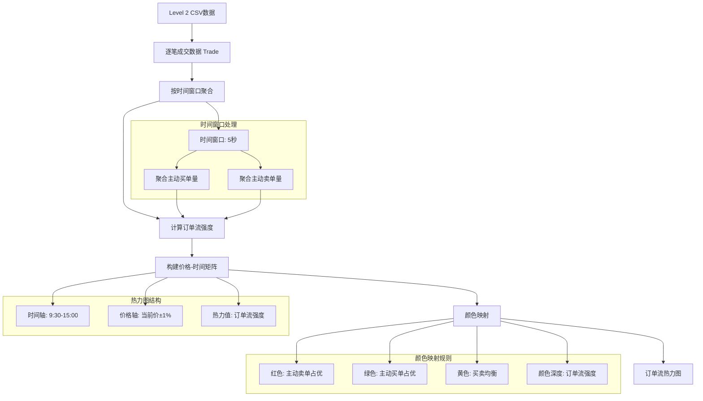
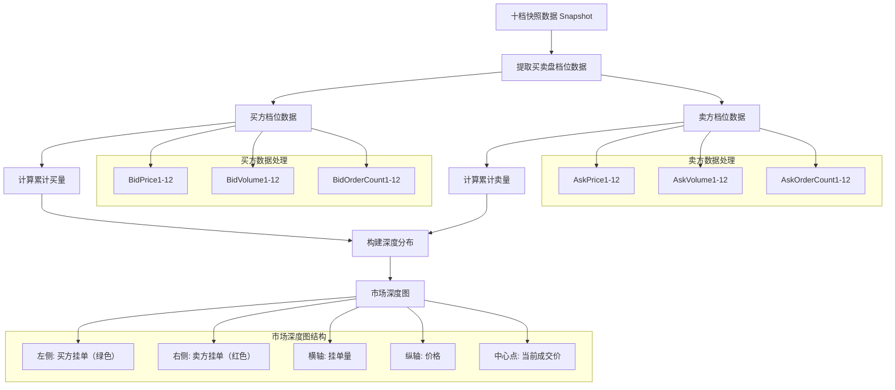
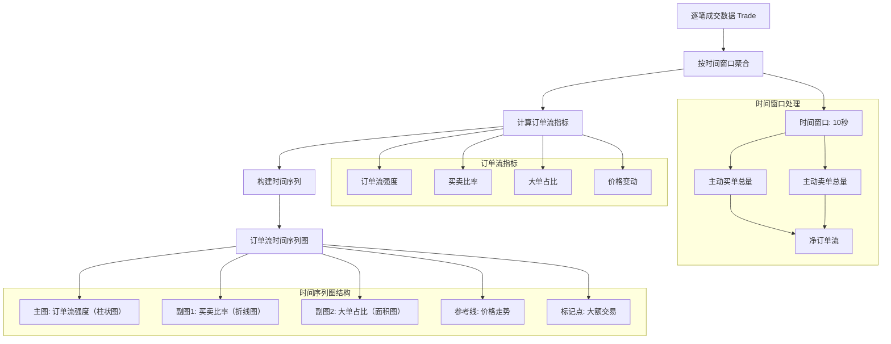

# 基于Level 2 CSV数据的订单流图表实现思路

## 1. 项目概述

本方案旨在基于离线Level 2 CSV数据，实现类似专业交易软件中的订单流图表，用于展示市场深度、订单分布和交易行为分析。

## 2. 数据结构分析

根据提供的Level 2 CSV数据结构，我们需要处理以下三类数据：

### 2.1 逐笔成交数据 (Trade)
- **SecuCode**: 股票代码
- **TradingDay**: 交易日期
- **DealTime**: 成交时间（精确到毫秒）
- **DealID**: 成交编号
- **BuyID**: 买单编号
- **SellID**: 卖单编号
- **Price**: 成交价格
- **Volume**: 成交量（股或手）
- **Side**: 方向（1: 主动买入, -1: 主动卖出, --1: 买单撤单, -11: 卖单撤单）
- **Channel**: 交易频道
- **BizIndex**: 交易所成交编号

### 2.2 逐笔委托数据 (Order)
- **SecuCode**: 股票代码
- **TradingDay**: 委托日期
- **OrderTime**: 委托时间（精确到毫秒）
- **OrderID**: 委托号
- **Price**: 委托价格
- **Volume**: 委托量
- **OrderType**: 委托类型（沪市：0: 委买, 1: 委卖, -1: 撤买, -11: 撤卖；深市类似）
- **LastPrice**: 委托时最近一笔成交价
- **Channel**: 交易频道
- **BizIndex**: 交易所委托编号
- **DBOrderID**: 入库ID

### 2.3 十档快照数据 (Snapshot)
- **SecuCode**: 证券代码
- **TradingDay**: 交易日
- **TickTime**: 行情时间（精确到毫秒）
- **TickTimeDiff**: Tick时间差（与上一条记录的时间间隔，单位毫秒）
- **Price**: 最新成交价
- **DealNum**: 单笔成交笔数
- **Volume**: 当前成交量（当前Tick的成交量）
- **Turnover**: 单笔成交额（Price × Volume）
- **TotalDealVolume**: 累计成交量（当日总成交股数/手数）
- **TotalTurnover**: 累计成交额（当日总成交金额）
- **TotalBidVolume**: 累计买量（买方挂单总量）
- **TotalAskVolume**: 累计卖量（卖方挂单总量）
- **TotalAskBidVolume**: 累计买卖总量（TotalBidVolume + TotalAskVolume）
- **WeightBidPrice**: 加权买价（按买盘挂单量加权的平均买入价）
- **WeightAskPrice**: 加权卖价（按卖盘挂单量加权的平均卖出价）
- **BidPrice1-BidPrice12**: 买方报价第1至第12档（数字越小越接近市价）
- **AskPrice1-AskPrice12**: 卖方报价第1至第12档
- **BidVolume1-BidVolume12**: 买方各档挂单量
- **AskVolume1-AskVolume12**: 卖方各档挂单量
- **BidOrderCount1-BidOrderCount12**: 买方各档挂单笔数
- **AskOrderCount1-AskOrderCount12**: 卖方各档挂单笔数

## 3. 核心图表设计与数据流程

### 3.1 订单流热力图

#### 3.1.1 图表示意



#### 3.1.2 数据组装查询

**查询步骤1：获取原始成交数据**

```python
import pandas as pd

# 读取逐笔成交数据
trade_df = pd.read_csv('trade_data.csv')

# 筛选主动买单和主动卖单（排除撤单）
active_trades = trade_df[trade_df['Side'].isin([1, -1])].copy()

# 转换时间格式
active_trades['DealTime'] = pd.to_datetime(active_trades['DealTime'], format='%H:%M:%S.%f')
```

**查询步骤2：按时间窗口聚合**

```python
# 设置时间窗口（如5秒）
time_window = '5S'

# 创建时间窗口分组
active_trades['time_bin'] = active_trades['DealTime'].dt.floor(time_window)

# 按时间窗口和价格聚合
aggregated = active_trades.groupby(['time_bin', 'Price']).agg({
    'Volume': 'sum',
    'Side': lambda x: (x == 1).sum() - (x == -1).sum()  # 订单流强度
}).rename(columns={'Side': 'order_flow_strength'})

aggregated = aggregated.reset_index()
```

**查询步骤3：构建热力图数据矩阵**

```python
import numpy as np

# 确定价格范围（当前价±1%）
current_price = active_trades['Price'].iloc[-1]
price_min = current_price * 0.99
price_max = current_price * 1.01

# 筛选价格范围内的数据
filtered = aggregated[(aggregated['Price'] >= price_min) & (aggregated['Price'] <= price_max)]

# 创建价格网格
price_step = 0.01  # 价格精度
price_bins = np.arange(price_min, price_max + price_step, price_step)

# 创建时间网格
time_bins = filtered['time_bin'].unique()
time_bins = sorted(time_bins)

# 初始化热力图矩阵
heatmap_matrix = np.zeros((len(time_bins), len(price_bins)))

# 填充热力图矩阵
for idx, row in filtered.iterrows():
    time_idx = time_bins.index(row['time_bin'])
    price_idx = np.searchsorted(price_bins, row['Price']) - 1
    if 0 <= price_idx < len(price_bins):
        heatmap_matrix[time_idx, price_idx] = row['order_flow_strength']

# 构建最终数据结构
heatmap_data = {
    'time_bins': [t.strftime('%H:%M:%S') for t in time_bins],
    'price_bins': price_bins.tolist(),
    'heatmap_matrix': heatmap_matrix.tolist(),
    'color_scale': {
        'min': heatmap_matrix.min(),
        'max': heatmap_matrix.max()
    }
}
```

### 3.2 市场深度图

#### 3.2.1 图表示意



#### 3.2.2 数据组装查询

**查询步骤1：提取买卖盘档位数据**

```python
import pandas as pd

# 读取十档快照数据
snapshot_df = pd.read_csv('snapshot_data.csv')

# 获取最新快照
latest_snapshot = snapshot_df.iloc[-1].copy()

# 提取买方档位数据
bid_data = []
for i in range(1, 13):
    price_col = f'BidPrice{i}'
    volume_col = f'BidVolume{i}'
    count_col = f'BidOrderCount{i}'
    
    if pd.notna(latest_snapshot[price_col]) and latest_snapshot[price_col] > 0:
        bid_data.append({
            'level': i,
            'price': latest_snapshot[price_col],
            'volume': latest_snapshot[volume_col],
            'order_count': latest_snapshot[count_col],
            'side': 'bid'
        })

# 提取卖方档位数据
ask_data = []
for i in range(1, 13):
    price_col = f'AskPrice{i}'
    volume_col = f'AskVolume{i}'
    count_col = f'AskOrderCount{i}'
    
    if pd.notna(latest_snapshot[price_col]) and latest_snapshot[price_col] > 0:
        ask_data.append({
            'level': i,
            'price': latest_snapshot[price_col],
            'volume': latest_snapshot[volume_col],
            'order_count': latest_snapshot[count_col],
            'side': 'ask'
        })
```

**查询步骤2：计算累计挂单量**

```python
import pandas as pd

# 转换为DataFrame
bid_df = pd.DataFrame(bid_data)
ask_df = pd.DataFrame(ask_data)

# 按价格排序（买方从高到低，卖方从低到高）
bid_df = bid_df.sort_values('price', ascending=False).reset_index(drop=True)
ask_df = ask_df.sort_values('price', ascending=True).reset_index(drop=True)

# 计算累计挂单量
bid_df['cumulative_volume'] = bid_df['volume'].cumsum()
ask_df['cumulative_volume'] = ask_df['volume'].cumsum()

# 获取当前成交价
current_price = latest_snapshot['Price']
```

**查询步骤3：构建深度图数据结构**

```python
# 构建深度图数据
depth_chart_data = {
    'current_price': current_price,
    'bid_side': {
        'prices': bid_df['price'].tolist(),
        'volumes': bid_df['volume'].tolist(),
        'cumulative_volumes': bid_df['cumulative_volume'].tolist(),
        'order_counts': bid_df['order_count'].tolist(),
        'levels': bid_df['level'].tolist()
    },
    'ask_side': {
        'prices': ask_df['price'].tolist(),
        'volumes': ask_df['volume'].tolist(),
        'cumulative_volumes': ask_df['cumulative_volume'].tolist(),
        'order_counts': ask_df['order_count'].tolist(),
        'levels': ask_df['level'].tolist()
    },
    'total_bid_volume': latest_snapshot['TotalBidVolume'],
    'total_ask_volume': latest_snapshot['TotalAskVolume'],
    'weighted_bid_price': latest_snapshot['WeightBidPrice'],
    'weighted_ask_price': latest_snapshot['WeightAskPrice']
}

# 计算深度指标
depth_chart_data['depth_metrics'] = {
    'bid_ask_spread': ask_df['price'].iloc[0] - bid_df['price'].iloc[0] if len(ask_df) > 0 and len(bid_df) > 0 else None,
    'bid_depth_1pct': calculate_depth_at_percent(bid_df, current_price, 0.01, 'bid'),
    'ask_depth_1pct': calculate_depth_at_percent(ask_df, current_price, 0.01, 'ask'),
    'liquidity_ratio': latest_snapshot['TotalBidVolume'] / latest_snapshot['TotalAskVolume'] if latest_snapshot['TotalAskVolume'] > 0 else None
}

def calculate_depth_at_percent(df, current_price, percent, side):
    """计算价格范围内的累计深度"""
    if side == 'bid':
        threshold = current_price * (1 - percent)
        filtered = df[df['price'] >= threshold]
    else:
        threshold = current_price * (1 + percent)
        filtered = df[df['price'] <= threshold]
    return filtered['volume'].sum() if len(filtered) > 0 else 0
```

### 3.3 订单流时间序列图

#### 3.3.1 图表示意



#### 3.3.2 数据组装查询

**查询步骤1：计算时间窗口内的订单流指标**

```python
import pandas as pd

# 读取逐笔成交数据
trade_df = pd.read_csv('trade_data.csv')

# 转换时间格式
trade_df['DealTime'] = pd.to_datetime(trade_df['DealTime'], format='%H:%M:%S.%f')

# 设置时间窗口（如10秒）
time_window = '10S'

# 创建时间窗口分组
trade_df['time_bin'] = trade_df['DealTime'].dt.floor(time_window)

# 定义大单阈值（如成交量>100手）
large_order_threshold = 100

# 按时间窗口聚合计算指标
time_series_data = trade_df.groupby('time_bin').agg({
    # 主动买单
    'Volume': [
        ('bid_volume', lambda x: x[(trade_df.loc[x.index, 'Side'] == 1)].sum()),
        # 主动卖单
        ('ask_volume', lambda x: x[(trade_df.loc[x.index, 'Side'] == -1)].sum()),
        # 大单买单
        ('large_bid_volume', lambda x: x[(trade_df.loc[x.index, 'Side'] == 1) & (x > large_order_threshold)].sum()),
        # 大单卖单
        ('large_ask_volume', lambda x: x[(trade_df.loc[x.index, 'Side'] == -1) & (x > large_order_threshold)].sum()),
        # 总成交量
        ('total_volume', 'sum')
    ],
    # 价格
    'Price': [
        ('open_price', 'first'),
        ('close_price', 'last'),
        ('high_price', 'max'),
        ('low_price', 'min'),
        ('avg_price', 'mean')
    ],
    # 成交笔数
    'DealID': 'count'
}).reset_index()

# 展平多级列名
time_series_data.columns = ['_'.join(col).strip('_') if col[1] else col[0] for col in time_series_data.columns]
```

**查询步骤2：计算衍生指标**

```python
# 计算订单流强度
time_series_data['order_flow_strength'] = time_series_data['Volume_bid_volume'] - time_series_data['Volume_ask_volume']

# 计算买卖比率
time_series_data['buy_sell_ratio'] = time_series_data['Volume_bid_volume'] / time_series_data['Volume_ask_volume'].replace(0, 1)

# 计算大单占比
time_series_data['large_order_ratio'] = (
    (time_series_data['Volume_large_bid_volume'] + time_series_data['Volume_large_ask_volume']) / 
    time_series_data['Volume_total_volume'].replace(0, 1)
)

# 计算价格变动
time_series_data['price_change'] = time_series_data['Price_close_price'] - time_series_data['Price_open_price']
time_series_data['price_change_pct'] = time_series_data['price_change'] / time_series_data['Price_open_price'].replace(0, 1) * 100
```

**查询步骤3：识别大额交易标记**

```python
# 识别大额交易
large_trades = trade_df[trade_df['Volume'] > large_order_threshold].copy()

# 按时间窗口统计大额交易
large_trades['time_bin'] = large_trades['DealTime'].dt.floor(time_window)
large_trade_markers = large_trades.groupby('time_bin').agg({
    'Volume': 'sum',
    'Price': ['first', 'last'],
    'Side': lambda x: (x == 1).sum() - (x == -1).sum()
}).reset_index()

large_trade_markers.columns = ['time_bin', 'total_large_volume', 'first_price', 'last_price', 'large_order_flow']

# 构建最终时间序列数据结构
time_series_chart_data = {
    'time_bins': [t.strftime('%H:%M:%S') for t in time_series_data['time_bin']],
    'order_flow_strength': time_series_data['order_flow_strength'].tolist(),
    'buy_sell_ratio': time_series_data['buy_sell_ratio'].tolist(),
    'large_order_ratio': time_series_data['large_order_ratio'].tolist(),
    'price_close': time_series_data['Price_close_price'].tolist(),
    'price_change_pct': time_series_data['price_change_pct'].tolist(),
    'total_volume': time_series_data['Volume_total_volume'].tolist(),
    'large_trade_markers': [
        {
            'time': t.strftime('%H:%M:%S'),
            'volume': vol,
            'direction': 'bid' if flow > 0 else 'ask' if flow < 0 else 'neutral',
            'price': (first + last) / 2
        }
        for t, vol, first, last, flow in zip(
            large_trade_markers['time_bin'],
            large_trade_markers['total_large_volume'],
            large_trade_markers['first_price'],
            large_trade_markers['last_price'],
            large_trade_markers['large_order_flow']
        )
    ]
}
```

## 4. 核心算法设计

### 4.1 订单流计算

#### 4.1.1 主动买单与主动卖单识别
- **主动买单**：Side = 1，表示以卖一价或更高价格买入
- **主动卖单**：Side = -1，表示以买一价或更低价格卖出
- **撤单**：Side = --1（买单撤单）或 -11（卖单撤单）

#### 4.1.2 订单流强度计算
- **订单流强度** = 主动买单量 - 主动卖单量
- **净订单流** = 订单流强度 / 总成交量

#### 4.1.3 价格档位分析
- **档位分布**：统计各价格档位的挂单量和成交情况
- **深度变化**：计算不同时间点的市场深度变化
- **流动性分析**：评估各价格档位的流动性

### 4.2 图表数据处理

#### 4.2.1 时间序列数据处理
- **时间窗口**：设置固定时间窗口（如1秒、5秒、10秒）
- **聚合计算**：在每个时间窗口内聚合订单流数据
- **平滑处理**：对数据进行平滑处理，减少噪声

#### 4.2.2 热力图生成
- **价格-时间矩阵**：构建价格和时间的二维矩阵
- **颜色映射**：根据订单流强度映射不同颜色（红色表示主动卖单，绿色表示主动买单）
- **热力值计算**：根据订单流强度计算热力值

## 5. 系统架构设计

### 5.1 数据处理层
- **数据解析模块**：解析CSV文件，提取结构化数据
- **数据清洗模块**：处理异常数据，填充缺失值
- **数据存储模块**：将处理后的数据存储为高效格式（如Parquet）

### 5.2 计算层
- **订单流计算模块**：计算订单流强度、净订单流等指标
- **市场深度分析模块**：分析各价格档位的挂单情况
- **交易行为分析模块**：识别大额交易、频繁交易等行为

### 5.3 可视化层
- **热力图生成模块**：生成订单流热力图
- **深度图生成模块**：生成市场深度图表
- **时间序列图表模块**：生成订单流时间序列图表

## 6. 技术栈选择

### 6.1 后端技术
- **数据处理**：Python (Pandas, NumPy)
- **数据存储**：Parquet, SQLite
- **计算引擎**：Dask (处理大规模数据)

### 6.2 前端技术
- **图表库**：ECharts, D3.js
- **前端框架**：Vue.js, React
- **数据传输**：WebSocket, REST API

### 6.3 工具库
- **数据解析**：csv, pandas
- **时间处理**：datetime, pytz
- **数值计算**：numpy, scipy

## 7. 实现步骤

### 7.1 数据预处理
1. **数据加载**：读取CSV文件到内存或内存映射
2. **数据清洗**：处理缺失值、异常值
3. **数据转换**：将字符串时间转换为时间戳
4. **数据索引**：按时间排序，建立时间索引

### 7.2 订单流计算
1. **逐笔成交分析**：识别主动买单和主动卖单
2. **订单流强度计算**：计算每个时间窗口的订单流强度
3. **市场深度分析**：分析各价格档位的挂单变化
4. **交易行为识别**：识别大额交易、撤单等行为

### 7.3 可视化实现
1. **热力图构建**：根据订单流强度构建价格-时间热力图
2. **深度图绘制**：绘制买卖盘深度分布
3. **时间序列图表**：绘制订单流强度时间序列
4. **交互功能**：实现缩放、时间范围选择等交互功能

## 8. 性能优化

### 8.1 数据处理优化
- **内存管理**：使用内存映射或分块处理大规模数据
- **并行计算**：使用多线程或分布式计算处理数据
- **缓存策略**：缓存计算结果，避免重复计算

### 8.2 可视化优化
- **数据抽样**：对大规模数据进行抽样处理
- **数据压缩**：使用压缩格式传输数据
- **渲染优化**：使用Canvas或WebGL进行高性能渲染

## 9. 功能特性

### 9.1 核心功能
- **订单流热力图**：展示价格-时间-订单流强度的热力分布
- **市场深度图**：展示买卖盘各档位的挂单情况
- **订单流时间序列**：展示订单流强度随时间的变化
- **交易行为分析**：识别大额交易、撤单等行为

### 9.2 辅助功能
- **时间范围选择**：支持选择不同时间范围
- **价格范围调整**：支持调整价格显示范围
- **数据导出**：支持导出分析结果
- **自定义指标**：支持自定义计算指标

## 10. 输入输出示例

### 10.1 输入示例
```csv
# 逐笔成交数据示例
SecuCode,TradingDay,DealTime,DealID,BuyID,SellID,Price,Volume,Side,Channel,BizIndex
600000,20240101,09:30:00.123,1,1001,2001,10.00,100,1,1,100001
600000,20240101,09:30:00.456,2,1002,2002,10.01,200,-1,1,100002

# 十档快照数据示例
SecuCode,TradingDay,TickTime,TickTimeDiff,Price,DealNum,Volume,Turnover,TotalDealVolume,TotalTurnover,TotalBidVolume,TotalAskVolume,TotalAskBidVolume,WeightBidPrice,WeightAskPrice,BidPrice1,BidPrice2,BidPrice3,AskPrice1,AskPrice2,AskPrice3,BidVolume1,BidVolume2,BidVolume3,AskVolume1,AskVolume2,AskVolume3
600000,20240101,09:30:00.000,0,10.00,0,0,0,0,0,1000,2000,3000,9.99,10.01,9.99,9.98,9.97,10.01,10.02,10.03,500,300,200,800,700,500
```

### 10.2 输出示例
- **订单流热力图**：价格-时间矩阵，颜色表示订单流强度
- **市场深度图**：买卖盘各档位的挂单量柱状图
- **订单流时间序列**：订单流强度随时间变化的折线图
- **交易行为分析**：大额交易、撤单等行为的标记和统计

## 11. 结论

基于Level 2 CSV数据实现订单流图表是一个涉及数据处理、计算分析和可视化的综合性项目。通过合理的系统架构设计和算法实现，可以构建出功能强大、性能高效的订单流分析工具，为交易决策提供有力支持。

该实现方案不仅可以用于离线数据分析，也可以扩展为实时订单流分析系统，为交易者提供更及时、更全面的市场信息。
